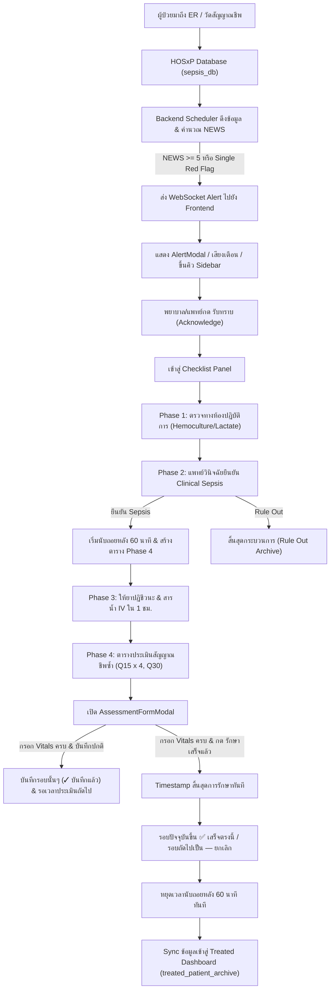

# 📘 RTSAS Codebase Guide — เอกสารอธิบายหน้าที่ของแต่ละไฟล์ในระบบ

> [!CAUTION]
> **⛔ สถานะเอกสาร: ห้ามแก้ไขไฟล์นี้เด็ดขาด (LOCKED / DO NOT EDIT)**  
> เอกสารนี้เป็นคู่มือโครงสร้างและสถาปัตยกรรมหลักของระบบ RTSAS ที่มีความถูกต้องและสมบูรณ์แล้ว **ห้ามผู้พัฒนาหรือ AI ทำการแก้ไข ปรับเปลี่ยน หรือลบเนื้อหาในไฟล์นี้อีกโดยเด็ดขาด**

> **จุดประสงค์ของเอกสาร**: จัดทำขึ้นเพื่อให้ผู้พัฒนา (Developer) และ AI Coding Assistant ที่เปิดแชทใหม่ สามารถทำความเข้าใจภาพรวมสถาปัตยกรรม, โครงสร้างไฟล์ทั้งหมด, หน้าที่ของแต่ละโมดูล, ตรรกะการทำงาน (Business Logic) และข้อกำหนดสำคัญของระบบ **RTSAS (Real-Time Sepsis Alert System)** ได้อย่างครบถ้วนทันที

---

## 📑 สารบัญ (Table of Contents)
1. [ภาพรวมของระบบและสถาปัตยกรรม (System Overview)](#1-ภาพรวมของระบบและสถาปัตยกรรม-system-overview)
2. [โครงสร้างภาพรวมของโปรเจกต์ (Project Directory Tree)](#2-โครงสร้างภาพรวมของโปรเจกต์-project-directory-tree)
3. [รหัสต้นฉบับฝั่ง Frontend (`src/`)](#3-รหัสต้นฉบับฝั่ง-frontend-src)
   - [3.1 จุดเริ่มต้นและสไตล์หลัก (Entry & Styling)](#31-จุดเริ่มต้นและสไตล์หลัก-entry--styling)
   - [3.2 การจัดการสถานะส่วนกลาง (Zustand Store)](#32-การจัดการสถานะส่วนกลาง-zustand-store)
   - [3.3 Custom React Hooks (`src/hooks/`)](#33-custom-react-hooks-srchooks)
   - [3.4 ชนิดข้อมูลและยูทิลิตี้ (`src/types/` & `src/utils/`)](#34-ชนิดข้อมูลและยูทิลิตี้-srctypes--srcutils)
   - [3.5 หน้าจอหลักของระบบ (`src/pages/`)](#35-หน้าจอหลักของระบบ-srcpages)
   - [3.6 แผงควบคุมคลินิก (`src/components/panels/`)](#36-แผงควบคุมคลินิก-srccomponentspanels)
   - [3.7 หน้าต่างป๊อปอัป (`src/components/modals/`)](#37-หน้าต่างป๊อปอัป-srccomponentsmodals)
   - [3.8 โครงร่างหน้าจอ (`src/components/layout/`)](#38-โครงร่างหน้าจอ-srccomponentslayout)
   - [3.9 คอมโพเนนต์ทั่วไปและการแจ้งเตือน (`src/components/common/`)](#39-คอมโพเนนต์ทั่วไปและการแจ้งเตือน-srccomponentscommon)
4. [รหัสต้นฉบับฝั่ง Backend (`backend/`)](#4-รหัสต้นฉบับฝั่ง-backend-backend)
   - [4.1 จุดเชื่อมต่อหลักและฐานข้อมูล (`main.py`, `config.py`, `database.py`)](#41-จุดเชื่อมต่อหลักและฐานข้อมูล-mainpy-configpy-databasepy)
   - [4.2 การประมวลผลและการจัดเก็บ (`scheduler.py`, `treatment_service.py`, `services.py`)](#42-การประมวลผลและการจัดเก็บ-schedulerpy-treatment_servicepy-servicespy)
   - [4.3 ระบบยืนยันตัวตนและความปลอดภัย (`backend/auth/`)](#43-ระบบยืนยันตัวตนและความปลอดภัย-backendauth)
5. [กระบวนการทำงานหลักทางคลินิก (Key Clinical Workflows)](#5-กระบวนการทำงานหลักทางคลินิก-key-clinical-workflows)
6. [กฎเหล็กและข้อกำหนดสำคัญในการแก้ไขโค้ด (Critical Rules & Constraints)](#6-กฎเหล็กและข้อกำหนดสำคัญในการแก้ไขโค้ด-critical-rules--constraints)
7. [รายการโมดูลที่เสร็จสมบูรณ์ 100% และห้ามแก้ไขแล้ว (Locked / Finalized Modules)](#7-รายการโมดูลที่เสร็จสมบูรณ์-100-และห้ามแก้ไขแล้ว-locked--finalized-modules)

---

## 1. ภาพรวมของระบบและสถาปัตยกรรม (System Overview)

**RTSAS (Real-Time Sepsis Alert System)** เป็นระบบเฝ้าระวัง แจ้งเตือน และติดตามการรักษาภาวะติดเชื้อในกระแสเลือด (Sepsis) แบบเรียลไทม์ สำหรับห้องอุบัติเหตุและฉุกเฉิน (ER) โรงพยาบาลบางคล้า จังหวัดฉะเชิงเทรา

### เทคโนโลยีที่ใช้ (Tech Stack)
- **Frontend**: React 19, TypeScript, Vite, Tailwind CSS / Vanilla CSS, Lucide Icons, Zustand (State Management with LocalStorage persistence), Vitest
- **Backend**: FastAPI (Python 3.11+), aiomysql (Async MySQL connection pool), SQLAlchemy (Auth DB), WebSockets (Real-time alert push), Uvicorn
- **ฐานข้อมูล (Multi-Database Architecture)**:
  1. `sepsis_db` (MySQL Port 3306): จำลองตาราง HOSxP (`patient_visits`, `opdscreen`, `er_nursing_detail`)
  2. `rtsas_dashboard` (MySQL Port 3306): ฐานข้อมูลส่วนกลางสำหรับสถานะการรักษา (`patient_treatment_status`, `treated_patient_archive`)
  3. `rtsas_auth` (MySQL Port 3307): ฐานข้อมูลสำหรับจัดการบัญชีผู้ใช้งานและสิทธิ์

---

## 2. โครงสร้างภาพรวมของโปรเจกต์ (Project Directory Tree)

```text
Hospital/
├── CODEBASE_GUIDE.md               # 👈 เอกสารคู่มืออธิบายโค้ดฉบับนี้
├── PROJECT_STRUCTURE.md            # โครงสร้างภาพรวมระดับโปรเจกต์
├── README.md                       # รายละเอียดการรันและติดตั้ง
├── TODO.md                         # บันทึกสถานะงานและการวางแผน (Local Planning)
├── docker-compose.yml              # การเปิดระบบ Full Stack ด้วย Docker Compose
├── frontend.Dockerfile             # Dockerfile สำหรับ Frontend (Nginx Alpine)
├── nginx.conf                      # Reverse Proxy จัดเส้นทาง /api, /ws และ Static Files
├── package.json                    # รายการไลบรารี Frontend (React 19, Vitest, Lucide)
├── tsconfig.json                   # การตั้งค่า Master TypeScript
├── tsconfig.app.json               # การตั้งค่า TypeScript Frontend พร้อม Path Alias (@/*)
├── vite.config.ts                  # การตั้งค่า Vite และ Path Alias (@/*)
│
├── docs/                           # คู่มือการใช้งานและรายงานการทดสอบ
│   ├── RTSAS_Complete_User_Manual.md # คู่มือผู้ใช้งานฉบับสมบูรณ์ (Markdown)
│   ├── RTSAS_User_Manual.docx      # คู่มือผู้ใช้งานฉบับ Word สำหรับโรงพยาบาล
│   ├── reports/                    # รายงานผลการทดสอบระบบและ QA Audits
│   └── images/                     # ภาพประกอบเอกสารคู่มือ
│
├── backup_data/                    # ไฟล์สำรองข้อมูล JSON สำหรับกู้คืนข้อมูลทดสอบ
│
├── src/                            # ⚛️ รหัสต้นฉบับ Frontend
│   ├── App.tsx                     # คอมโพเนนต์หลัก จัดการ Routing และ Layout
│   ├── main.tsx                    # Entry Point ของ React
│   ├── index.css                   # Global Styles, CSS Tokens & Animations
│   ├── pages/                      # หน้าจอระดับ Full-page
│   │   ├── TreatedDashboard.tsx    # หน้าแดชบอร์ดสรุปผู้ป่วยที่รักษาแล้ว
│   │   ├── AdminPage.tsx           # หน้าศูนย์จัดการระบบ IT Admin
│   │   ├── LoginPage.tsx           # หน้าจอ Login แบบ Standalone
│   │   └── admin/                  # โมดูลย่อยของหน้า Admin (Cleaner, Simulators, Users)
│   ├── components/                 # คอมโพเนนต์ย่อยแยกตามหมวดหมู่
│   │   ├── layout/                 # Header, Sidebar, StatusBar
│   │   ├── panels/                 # Clinical Panels (Vitals, Checklist, Timeline)
│   │   ├── modals/                 # Popups & Dialogs ทั้งหมด
│   │   └── common/                 # Toast, Loading, Banners
│   ├── hooks/                      # Custom React Hooks (useBackend, useTimers)
│   ├── store/                      # Zustand Store (useRTSASStore.ts)
│   ├── types/                      # TypeScript Interfaces
│   ├── utils/                      # Helper Functions (NEWS, Mask, Sound, Export)
│   ├── data/                       # Mock Data สำหรับการทดสอบ
│   └── __tests__/                  # Unit & Integration Tests (Vitest)
│
└── backend/                        # 🐍 รหัสต้นฉบับ Backend (FastAPI)
    ├── main.py                     # API Routes, WebSocket Server, Lifespan
    ├── config.py                   # อ่านค่าการตั้งค่าจาก Environment (.env)
    ├── database.py                 # Async MySQL Connection Pools (sepsis_db, rtsas_dashboard)
    ├── database_auth.py            # SQLAlchemy Engine สำหรับ rtsas_auth
    ├── scheduler.py                # Background Polling (Sync HOSxP ทุก 30 วิ)
    ├── treatment_service.py        # บริการจัดการสถานะการรักษาและ Archive ส่วนกลาง
    ├── dashboard_service.py        # การคำนวณและสรุปสถิติประจำวัน
    ├── services.py                 # ดึงข้อมูลผู้ป่วยจาก MySQL และคำนวณ NEWS
    ├── schemas.py                  # Pydantic Schemas ของข้อมูลผู้ป่วยและ Vitals
    ├── log_service.py              # บันทึก Log การทำงานของระบบลง SQLite
    ├── auth/                       # โมดูลยืนยันตัวตน (JWT, bcrypt, user model)
    └── tests/                      # Python Unit Tests (unittest)
```

---

## 3. รหัสต้นฉบับฝั่ง Frontend (`src/`)

### 3.1 จุดเริ่มต้นและสไตล์หลัก (Entry & Styling)

- **[`src/main.tsx`](file:///Users/phatchara/Desktop/Hospital/src/main.tsx)**  
  จุดเริ่มต้นการ Mount React Application เข้ากับ DOM Element `#root` ใน `index.html` พร้อมเรียกใช้ `index.css`
- **[`src/App.tsx`](file:///Users/phatchara/Desktop/Hospital/src/App.tsx)**  
  คอมโพเนนต์หลักที่ทำหน้าที่เป็น View Router สลับหน้าจอระหว่าง:
  1. `monitoring`: หน้าจอหลักสำหรับติดตามและดูแลผู้ป่วยสดใน ER
  2. `treated_dashboard`: หน้าจอแดชบอร์ดสรุปสถิติผู้ป่วยที่รักษาเสร็จแล้ว
  3. `admin`: หน้าจอผู้ดูแลระบบ IT Admin
  4. `login`: หน้าต่างเข้าสู่ระบบ  
  พร้อมเป็นจุดเรียกใช้ Custom Hooks (`useBackend`, `useTimers`) และเรนเดอร์ Modals ทั้งหมด
- **[`src/index.css`](file:///Users/phatchara/Desktop/Hospital/src/index.css)**  
  กำหนด CSS Design Tokens, Font ครอบคลุมภาษาไทย, Animations (`animate-slideUp`, `animate-pulse-btn`, `animate-fade-in`) และจัดระเบียบ Scrollbar

---

### 3.2 การจัดการสถานะส่วนกลาง (Zustand Store)

- **[`src/store/useRTSASStore.ts`](file:///Users/phatchara/Desktop/Hospital/src/store/useRTSASStore.ts)** ⭐ *(ศูนย์กลางการจัดการ State ทั้งหมดของ Frontend)*  
  ใช้ Zustand จัดเก็บสถานะแบบ Single Source of Truth พร้อมบันทึกลง `localStorage` (`rtsas-storage`):
  - **Selected Patient & Patients List**: เก็บรายชื่อผู้ป่วยที่ดึงมาจาก Backend และเคสที่กำลังเลือกดู
  - **Per-Patient State Isolation (`patientData[id]`)**: แยกข้อมูล Checklist, Countdown Timer, Assessment Schedule, Timeline ออกเป็นรายบุคคลอย่างเด็ดขาด ไม่ปะปนกัน
  - **Checklist Engine**: จัดการขั้นตอนการรักษา Phase 1–4, การบันทึกเวลา, การติ๊กเลือก, การข้าม (Skip), และการปลดล็อกตามลำดับ (Sequential Unlocking)
  - **Treatment Lifecycle**: จัดการฟังก์ชัน `completeAssessment`, `completeTreatment`, `ruleOutSepsis`
  - **Historical Patient Lock (`isHistoricalPatient`)**: ฟังก์ชันตรวจสอบและล็อกเคสในอดีต ห้ามแก้ไข Checklist ย้อนหลังเพื่อความปลอดภัยทางเวชระเบียน
  - **Memory Cleanup (`clearInactivePatientsMemory`)**: ทำความสะอาดหน่วยความจำ ลบเคสเก่าที่ไม่เกี่ยวข้อง โดยคุ้มครองเคสที่กำลังรักษาอยู่เสมอ

---

### 3.3 Custom React Hooks (`src/hooks/`)

- **[`src/hooks/useBackend.ts`](file:///Users/phatchara/Desktop/Hospital/src/hooks/useBackend.ts)**  
  - ดึงข้อมูลรายชื่อผู้ป่วยจาก Backend (`GET /api/patients`) ทุกรอบ Polling (ค่าเริ่มต้น 60 วินาที หรือกดดึงข้อมูลทันที)
  - เชื่อมต่อ WebSocket (`/ws/alerts`) เพื่อรับ Event แจ้งเตือนฉุกเฉินแบบ Real-time ทันทีที่พบผู้ป่วยเสี่ยงสูงรายใหม่
  - จัดการ Reconnection อัตโนมัติเมื่อเครือข่ายหลุด และนำข้อมูล Alert เข้าสู่คิวแจ้งเตือน
- **[`src/hooks/useTimers.ts`](file:///Users/phatchara/Desktop/Hospital/src/hooks/useTimers.ts)**  
  - นับถอยหลัง Sepsis 60 นาที (1-Hour Bundle Countdown) ทุก 1 วินาที
  - ตรวจสอบรอบเวลาประเมินสัญญาณชีพซ้ำ (Q15 4 ครั้งแรก แล้วตามด้วย Q30) และเรียกเปิด `ReminderModal` แจ้งเตือนพยาบาลเมื่อถึงเวลา

---

### 3.4 ชนิดข้อมูลและยูทิลิตี้ (`src/types/` & `src/utils/`)

- **[`src/types/index.ts`](file:///Users/phatchara/Desktop/Hospital/src/types/index.ts)**  
  สัญญาข้อมูล (Data Contracts) ทั้งหมด เช่น `Patient`, `VitalSigns`, `NEWSResult`, `ChecklistItem`, `AssessmentScheduleEntry`, `TimelineEvent`, `User`, `AVPU`
- **[`src/utils/newsCalculator.ts`](file:///Users/phatchara/Desktop/Hospital/src/utils/newsCalculator.ts)**  
  ฟังก์ชันคำนวณคะแนน NEWS 2017 ตามเกณฑ์ Royal College of Physicians (UK) จาก 6 พารามิเตอร์ (RR, SpO₂, Temp, SBP, HR, AVPU) พร้อมส่งคืนระดับความเสี่ยง
- **[`src/utils/hnMask.ts`](file:///Users/phatchara/Desktop/Hospital/src/utils/hnMask.ts)**  
  ฟังก์ชันปิดบังข้อมูล HN ตามมาตรฐาน PDPA โดยแสดงเฉพาะ 4 หลักท้าย (เช่น `HN****8675`)
- **[`src/utils/alertSound.ts`](file:///Users/phatchara/Desktop/Hospital/src/utils/alertSound.ts)**  
  สังเคราะห์เสียงแจ้งเตือนฉุกเฉินด้วย Web Audio API โดยไม่ต้องพึ่งพาไฟล์เสียงภายนอก
- **[`src/utils/exportReport.ts`](file:///Users/phatchara/Desktop/Hospital/src/utils/exportReport.ts)**  
  สร้างและดาวน์โหลดรายงานการรักษาในรูปแบบ CSV (พร้อม UTF-8 BOM รองรับภาษาไทยใน Microsoft Excel) และพิมพ์สรุป PDF
- **[`src/utils/patientMemory.ts`](file:///Users/phatchara/Desktop/Hospital/src/utils/patientMemory.ts)**  
  จัดการหน่วยความจำของ Store และแปลงประวัติ Timeline เป็นข้อความสำหรับคัดลอกลง HIS Note
- **[`src/utils/patientMapper.ts`](file:///Users/phatchara/Desktop/Hospital/src/utils/patientMapper.ts)**  
  แปลงข้อมูลดิบจาก API HOSxP ให้อยู่ในโครงสร้าง `Patient` ของระบบ
- **[`src/utils/errorUtils.ts`](file:///Users/phatchara/Desktop/Hospital/src/utils/errorUtils.ts)**  
  แปลง Technical Errors เป็นข้อความภาษาไทยที่เข้าใจง่ายสำหรับเจ้าหน้าที่คลินิก

---

### 3.5 หน้าจอหลักของระบบ (`src/pages/`)

- **[`src/pages/TreatedDashboard.tsx`](file:///Users/phatchara/Desktop/Hospital/src/pages/TreatedDashboard.tsx)**  
  หน้าจอแดชบอร์ดสรุปสถิติผู้ป่วยที่ผ่านการรักษาแล้ว (Sepsis Bundle Done หรือ Rule Out):
  - แสดง KPI Cards: เคสทั้งหมด, เสี่ยง Sepsis, รักษาสำเร็จ (Bundle Done), Compliance Rate
  - ตารางเปรียบเทียบสถิติรายวันย้อนหลัง 14 วัน
  - ตารางรายชื่อเคสที่รักษาแล้ว (Masked HN ตาม PDPA) พร้อมปุ่มคลิกดูประวัติการรักษา (Timeline Modal)
- **[`src/pages/AdminPage.tsx`](file:///Users/phatchara/Desktop/Hospital/src/pages/AdminPage.tsx)**  
  หน้าหลักสำหรับผู้ดูแลระบบ IT และหัวหน้าเวร แบ่งเป็นแท็บย่อย
- **[`src/pages/admin/DashboardCleaner.tsx`](file:///Users/phatchara/Desktop/Hospital/src/pages/admin/DashboardCleaner.tsx)**  
  เครื่องมือจัดการและล้างข้อมูลจำลอง: เคลียร์เคสทดสอบออกจาก Treated Dashboard, คืนหน่วยความจำ RAM และรีเซ็ตระบบก่อนการใช้งานจริง
- **[`src/pages/admin/PatientSimulator.tsx`](file:///Users/phatchara/Desktop/Hospital/src/pages/admin/PatientSimulator.tsx)**  
  เครื่องมือจำลองสร้างผู้ป่วยใหม่อัตโนมัติ เพื่อทดสอบการรับเคสเข้าสู่ห้องฉุกเฉิน
- **[`src/pages/admin/AlertSimulator.tsx`](file:///Users/phatchara/Desktop/Hospital/src/pages/admin/AlertSimulator.tsx)**  
  เครื่องมือทดสอบยิง Alert จำลองแบบ Real-time ผ่าน WebSocket
- **[`src/pages/admin/DatabaseFailoverTester.tsx`](file:///Users/phatchara/Desktop/Hospital/src/pages/admin/DatabaseFailoverTester.tsx)**  
  เครื่องมือทดสอบการตัดการเชื่อมต่อ MySQL เพื่อตรวจสอบความทนทาน (Resilience) และการใช้ SQLite Cache สำรอง
- **[`src/pages/admin/UserManagement.tsx`](file:///Users/phatchara/Desktop/Hospital/src/pages/admin/UserManagement.tsx)**  
  จัดการบัญชีผู้ใช้งานระบบ กำหนดสิทธิ์บทบาท (แพทย์, พยาบาล, IT Admin)
- **[`src/pages/LoginPage.tsx`](file:///Users/phatchara/Desktop/Hospital/src/pages/LoginPage.tsx)**  
  หน้าจอลงชื่อเข้าใช้งานแบบ Standalone

---

### 3.6 แผงควบคุมคลินิก (`src/components/panels/`)

- **[`src/components/panels/PatientInfoBar.tsx`](file:///Users/phatchara/Desktop/Hospital/src/components/panels/PatientInfoBar.tsx)**  
  แถบแสดงข้อมูลสรุปของผู้ป่วยที่กำลังเลือกดู: Masked HN, เพศ, อายุ, สิทธิการรักษา, อาการสำคัญ (Chief Complaint) และเวลาที่อยู่ใน ER
- **[`src/components/panels/VitalSignsGrid.tsx`](file:///Users/phatchara/Desktop/Hospital/src/components/panels/VitalSignsGrid.tsx)**  
  การ์ดแสดงสัญญาณชีพ 6 ค่า (RR, SpO₂, Temp, SBP, HR, GCS/AVPU) พร้อมสีและคะแนนย่อยตามเกณฑ์ NEWS
- **[`src/components/panels/NewsCalculationLogic.tsx`](file:///Users/phatchara/Desktop/Hospital/src/components/panels/NewsCalculationLogic.tsx)**  
  แผงแจกแจงเกณฑ์คะแนน NEWS แบบละเอียด แสดงค่าจริงเทียบกับช่วงคะแนน ให้ทีมแพทย์ตรวจสอบที่มาของความเสี่ยงได้อย่างโปร่งใส
- **[`src/components/panels/ChecklistPanel.tsx`](file:///Users/phatchara/Desktop/Hospital/src/components/panels/ChecklistPanel.tsx)**  
  แผงขั้นตอนการรักษา Sepsis Bundle แบ่งเป็น 4 ระยะ:
  - **Phase 1**: วินิจฉัยเบื้องต้น (Hemoculture, CBC, Lactate)
  - **Phase 2**: แพทย์ยืนยันการรักษา (Doctor Clinical Confirmation หรือ Rule Out)
  - **Phase 3**: การให้การรักษาเร่งด่วนใน 1 ชั่วโมง (Antibiotic, IV Fluid, Foley Cath)
  - **Phase 4**: ตารางประเมินสัญญาณชีพซ้ำ (Q15 4 ครั้งแรก จากนั้น Q30) **เมื่อกดบันทึกที่รอบใด จะเปิด `AssessmentFormModal` เพื่อบันทึกหรือจบการรักษา**
- **[`src/components/panels/TimelinePanel.tsx`](file:///Users/phatchara/Desktop/Hospital/src/components/panels/TimelinePanel.tsx)**  
  บันทึกประวัติการดูแลรักษาทางการแพทย์ตามลำดับเวลา (Timestamp Audit Trail) พร้อมปุ่มคัดลอกข้อความนำไปวางในระบบเวชระเบียนโรงพยาบาล (HIS Format)

---

### 3.7 หน้าต่างป๊อปอัป (`src/components/modals/`)

- **[`src/components/modals/AssessmentFormModal.tsx`](file:///Users/phatchara/Desktop/Hospital/src/components/modals/AssessmentFormModal.tsx)** ⭐ *(สำคัญมาก)*  
  หน้าต่างฟอร์มบันทึกสัญญาณชีพซ้ำใน Phase 4:
  - ช่องกรอก Vital Signs 6 ค่า พร้อมคำนวณ NEWS และแปลง GCS -> AVPU อัตโนมัติ
  - **ระบบแจ้งเตือนข้อมูลไม่ครบ**: มีแถบเตือนสีเหลือง `⚠️ ยังกรอกข้อมูลไม่ครบถ้วน (X/6 ช่อง)` บังคับกรอกครบก่อนบันทึก
  - **ปุ่ม `💾 บันทึกการประเมิน`**: บันทึกเฉพาะรอบนั้นตามปกติ
  - **ปุ่ม `✅ รักษาเสร็จแล้ว`**: กดยืนยันสองขั้นตอน (`⚠️ ยืนยันเสร็จสิ้น`) จะทำการ **Timestamp จบการรักษาที่รอบปัจจุบันทันที** (รอบนี้จะขึ้น `✅ เสร็จตรงนี้` และรอบถัดไปเป็น `— ยกเลิก`), หยุดตัวนับเวลา Countdown และส่งเคสเข้า Treated Dashboard ทันที
- **[`src/components/modals/AlertModal.tsx`](file:///Users/phatchara/Desktop/Hospital/src/components/modals/AlertModal.tsx)**  
  หน้าต่างแจ้งเตือนฉุกเฉินสีแดง/ส้มเมื่อมีผู้ป่วยเสี่ยงสูง (NEWS ≥ 5 หรือ Single Red Flag) แสดงข้อมูลสรุปและปุ่มรับทราบ (Acknowledge)
- **[`src/components/modals/MultiAlertModal.tsx`](file:///Users/phatchara/Desktop/Hospital/src/components/modals/MultiAlertModal.tsx)**  
  หน้าต่างคิวแจ้งเตือนผู้ป่วยวิกฤตพร้อมกันหลายราย ให้เจ้าหน้าที่ไล่รับทราบทีละรายอย่างปลอดภัย
- **[`src/components/modals/ReminderModal.tsx`](file:///Users/phatchara/Desktop/Hospital/src/components/modals/ReminderModal.tsx)**  
  หน้าต่างเตือนเมื่อถึงรอบเวลาประเมินสัญญาณชีพซ้ำ (Q15 / Q30)
- **[`src/components/modals/AuthModal.tsx`](file:///Users/phatchara/Desktop/Hospital/src/components/modals/AuthModal.tsx)**  
  หน้าต่างเข้าสู่ระบบ / ลงทะเบียนผู้ใช้งาน
- **[`src/components/modals/ExportReportModal.tsx`](file:///Users/phatchara/Desktop/Hospital/src/components/modals/ExportReportModal.tsx)**  
  หน้าต่างเลือกส่งออกรายงานสถิติประจำวัน (CSV / พิมพ์สรุป)
- **[`src/components/modals/SystemLogsModal.tsx`](file:///Users/phatchara/Desktop/Hospital/src/components/modals/SystemLogsModal.tsx)**  
  หน้าต่างดูบันทึกเหตุการณ์และ Log การทำงานของระบบ

---

### 3.8 โครงร่างหน้าจอ (`src/components/layout/`)

- **[`src/components/layout/Header.tsx`](file:///Users/phatchara/Desktop/Hospital/src/components/layout/Header.tsx)**  
  ส่วนหัวของระบบ แสดงชื่อโรงพยาบาล, นาฬิกาเรียลไทม์, ผู้ใช้งานปัจจุบัน, ปุ่มสลับไปยัง Treated Dashboard, ปุ่ม Admin และปุ่มเปิด Modal ต่าง ๆ
- **[`src/components/layout/Sidebar.tsx`](file:///Users/phatchara/Desktop/Hospital/src/components/layout/Sidebar.tsx)**  
  แถบด้านซ้าย แสดงคิวผู้ป่วยใน ER:
  - แยกหมวดหมู่: ผู้ป่วยกำลังรักษา, ผู้ป่วยเสี่ยงวิกฤต, ผู้ป่วยที่รักษาเสร็จแล้ว
  - แสดงคะแนน NEWS, เวลาที่อยู่ใน ER, และตัวนับเวลานับถอยหลังของแต่ละเคส
- **[`src/components/layout/StatusBar.tsx`](file:///Users/phatchara/Desktop/Hospital/src/components/layout/StatusBar.tsx)**  
  แถบสถานะด้านล่างสุดของจอ: แสดงสถานะการเชื่อมต่อเครือข่าย, สถานะ HOSxP Sync และเวอร์ชันของระบบ

---

### 3.9 คอมโพเนนต์ทั่วไปและการแจ้งเตือน (`src/components/common/`)

- **[`src/components/common/Toast.tsx`](file:///Users/phatchara/Desktop/Hospital/src/components/common/Toast.tsx)**  
  ระบบแจ้งเตือน Toast ลอยมุมขวาบน มีฟังก์ชัน `showToast(msg, type)` สำหรับข้อความสำเร็จหรือข้อผิดพลาด
- **[`src/components/common/CountdownBanner.tsx`](file:///Users/phatchara/Desktop/Hospital/src/components/common/CountdownBanner.tsx)**  
  แถบสีแจ้งเตือนเวลานับถอยหลัง 60 นาที (1-Hour Sepsis Protocol) แสดงอยู่ด้านบนของแผง Checklist
- **[`src/components/common/AlertSummaryBanner.tsx`](file:///Users/phatchara/Desktop/Hospital/src/components/common/AlertSummaryBanner.tsx)**  
  แถบสรุปยอดเตือนสีแดงด้านบนสุดเมื่อมีผู้ป่วยเสี่ยงสูงที่ยังไม่ได้รับทราบ
- **[`src/components/common/LoadingSkeleton.tsx`](file:///Users/phatchara/Desktop/Hospital/src/components/common/LoadingSkeleton.tsx)**  
  โครงร่างแสดงระหว่างที่ระบบกำลังโหลดข้อมูล
- **[`src/components/common/ErrorBanner.tsx`](file:///Users/phatchara/Desktop/Hospital/src/components/common/ErrorBanner.tsx)**  
  แถบแจ้งเตือนเมื่อเกิดข้อผิดพลาดในการเชื่อมต่อฐานข้อมูล พร้อมปุ่ม Retry

---

## 4. รหัสต้นฉบับฝั่ง Backend (`backend/`)

### 4.1 จุดเชื่อมต่อหลักและฐานข้อมูล (`main.py`, `config.py`, `database.py`)

- **[`backend/main.py`](file:///Users/phatchara/Desktop/Hospital/backend/main.py)**  
  จุดศูนย์กลางของ FastAPI:
  - ลงทะเบียน API Endpoints: `/api/patients`, `/api/treatment-status/*`, `/api/dashboard/*`, `/api/admin/*`
  - จัดการ WebSocket Connection Manager สำหรับส่งแจ้งเตือนแบบ Real-time ทันที
  - กำหนด Lifespan จัดการเปิด/ปิด Connection Pool และรัน Background Scheduler
- **[`backend/config.py`](file:///Users/phatchara/Desktop/Hospital/backend/config.py)**  
  กำหนดตัวแปรคอนฟิก (`Settings`) อ่านค่าจาก `.env` สำหรับเชื่อมต่อ Host, Port, รหัสผ่านของฐานข้อมูลทั้ง 3 ตัว
- **[`backend/database.py`](file:///Users/phatchara/Desktop/Hospital/backend/database.py)**  
  สร้างและดูแล Async Connection Pools ด้วย `aiomysql`:
  - `db_pool`: เชื่อมต่อ `sepsis_db` (อ่านข้อมูลผู้ป่วยและ Vitals)
  - `dashboard_pool`: เชื่อมต่อ `rtsas_dashboard` (บันทึกสถานะการรักษาและ Archive)
- **[`backend/database_auth.py`](file:///Users/phatchara/Desktop/Hospital/backend/database_auth.py)**  
  สร้าง SQLAlchemy Engine สำหรับระบบ User Authentication

---

### 4.2 การประมวลผลและการจัดเก็บ (`scheduler.py`, `treatment_service.py`, `services.py`)

- **[`backend/scheduler.py`](file:///Users/phatchara/Desktop/Hospital/backend/scheduler.py)**  
  ระบบ Polling พื้นหลัง: ดึงข้อมูลจากฐานข้อมูล HOSxP ทุก 30 วินาที, คำนวณ NEWS และเก็บ Cache ในหน่วยความจำเพื่อตอบสนองต่อคำขอได้อย่างรวดเร็ว
- **[`backend/treatment_service.py`](file:///Users/phatchara/Desktop/Hospital/backend/treatment_service.py)** ⭐  
  บริการจัดการสถานะการรักษาแบบ Centralized:
  - จัดการตาราง `patient_treatment_status` (รับทราบเคส, ยืนยันการรักษา, อัปเดต Checklist)
  - จัดการตาราง `treated_patient_archive` (เก็บประวัติผู้ป่วยที่รักษาเสร็จแล้วสำหรับ Dashboard รายวัน)
  - คำนวณสถิติย้อนหลัง 14 วัน (`get_archived_stats`)
  - ล้างข้อมูลสถานะเมื่อมีการรีเซ็ต (`clear_treated_statuses`)
- **[`backend/services.py`](file:///Users/phatchara/Desktop/Hospital/backend/services.py)**  
  ตรรกะการคิวรีฐานข้อมูล HOSxP ดึงค่าสัญญาณชีพจาก `opdscreen`, `er_nursing_detail`, `patient_visits` และคำนวณ NEWS 2017
- **[`backend/log_service.py`](file:///Users/phatchara/Desktop/Hospital/backend/log_service.py)**  
  บันทึก Log การทำงานของระบบและสุขภาพของฐานข้อมูลลง SQLite ในเครื่องสำหรับ Audit

---

### 4.3 ระบบยืนยันตัวตนและความปลอดภัย (`backend/auth/`)

- **[`backend/auth/models.py`](file:///Users/phatchara/Desktop/Hospital/backend/auth/models.py)**: ตาราง `users` (id, username, hashed_password, role, full_name)
- **[`backend/auth/router.py`](file:///Users/phatchara/Desktop/Hospital/backend/auth/router.py)**: API Routes สำหรับ `/auth/login`, `/auth/register`, `/auth/me`
- **[`backend/auth/service.py`](file:///Users/phatchara/Desktop/Hospital/backend/auth/service.py)**: ฟังก์ชันแฮชรหัสผ่าน bcrypt และสร้าง/ตรวจสอบ JWT Token
- **[`backend/auth/schemas.py`](file:///Users/phatchara/Desktop/Hospital/backend/auth/schemas.py)**: Pydantic Validation สำหรับ User Request/Response

---

## 5. กระบวนการทำงานหลักทางคลินิก (Key Clinical Workflows)



---

## 6. กฎเหล็กและข้อกำหนดสำคัญในการแก้ไขโค้ด (Critical Rules & Constraints)

> [!WARNING]
> **กฎสำคัญมากที่ต้องปฏิบัติตามอย่างเคร่งครัดเมื่อทำการแก้ไขโค้ด:**

1. **ห้ามเปลี่ยนหรือแก้ไข CSS / Styles เดิมโดยเด็ดขาด**:
   - ผู้ใช้งานกำหนดไว้ชัดเจนว่าให้คงสไตล์เดิมไว้ 100% ปรับแก้ได้เฉพาะตรรกะภายใน (Logic) เท่านั้น
2. **การจบการรักษาต้องทำผ่าน [`AssessmentFormModal.tsx`](file:///Users/phatchara/Desktop/Hospital/src/components/modals/AssessmentFormModal.tsx) เท่านั้น**:
   - ลบปุ่ม "สิ้นสุดการรักษา" ที่ซ้ำซ้อนออกจาก `ChecklistPanel.tsx` ไปแล้ว ห้ามเพิ่มปุ่มจบการรักษากลับเข้าไปใน Checklist อีก
   - การกด `✅ รักษาเสร็จแล้ว` ใน `AssessmentFormModal` จะตั้งค่ารอบปัจจุบันเป็น `isCanceled: true, isCompleted: true` เพื่อให้แสดงป้าย `✅ เสร็จตรงนี้` ในรอบที่บันทึกจริง
3. **บังคับกรอกสัญญาณชีพครบทั้ง 6 ช่องก่อนบันทึก**:
   - มีแถบเตือนสีเหลือง `⚠️ ยังกรอกข้อมูลไม่ครบถ้วน (X/6 ช่อง)` เพื่อป้องกันการบันทึกข้อมูลที่ไม่สมบูรณ์
4. **ความปลอดภัยของข้อมูลผู้ป่วย (PDPA Masking)**:
   - ทุกหน้าที่แสดงผลต่อผู้ใช้งานทั่วไป ต้องผ่านฟังก์ชัน `maskHN()` เสมอ (แสดงรูปแบบ `HN****XXXX`)
5. **การทดสอบความถูกต้อง**:
   - ก่อนส่งมอบงาน ต้องรันตรวจสอบความถูกต้องเสมอด้วยคำสั่ง:
     - `npx tsc --noEmit` (ต้องผ่าน 0 errors)
     - `npm test -- --run` (ต้องผ่านครบทุก Test Suites)

---

## 7. รายการโมดูลที่เสร็จสมบูรณ์ 100% และห้ามแก้ไขแล้ว (Locked / Finalized Modules)

> [!IMPORTANT]
> **โมดูลในรายการด้านล่างนี้ได้รับการพัฒนา ตรวจสอบความถูกต้อง ทดสอบ Unit Tests ผ่าน 100% และผ่านการยืนยันการใช้งานจริงทางคลินิกเรียบร้อยแล้ว ห้ามทำการดัดแปลง แก้ไข หรือเขียนทับโค้ดในส่วนเหล่านี้อีกโดยเด็ดขาด:**

| โมดูล / ไฟล์ | สถานะ | รายละเอียดการทำงานที่สมบูรณ์แล้ว (ห้ามแก้ไข) |
|---|:---:|---|
| **[`src/components/layout/Sidebar.tsx`](file:///Users/phatchara/Desktop/Hospital/src/components/layout/Sidebar.tsx)** | 🔒 **LOCKED** | • แสดงรายชื่อผู้ป่วย ER เรียงตามความเสี่ยง NEWS<br>• มี Badge จับเวลานับถอยหลัง 60 นาทีแบบ Real-time<br>• ระบบ Auto-refresh ทุก 10 วินาทีแบบ Background โดยไม่รบกวนหน้าจอรักษา<br>• ปุ่ม "🔄 ดึงข้อมูล" อัปเดตรายชื่อผู้ป่วยโดยไม่รีเฟรชทั้งเว็บ<br>• คลิกการ์ดผู้ป่วยแล้วเปิดเคสเสมอ ไม่หลุดไปหน้าว่าง (`EmptyState`) |
| **[`vite.config.ts`](file:///Users/phatchara/Desktop/Hospital/vite.config.ts)** | 🔒 **LOCKED** | • ตั้งค่า `server.watch.ignored` ข้ามโฟลเดอร์ `backend/**`, `.db`, `.sqlite`, `.log`<br>• ป้องกันปัญหา Vite สั่ง Page Reload ทั้งแท็บ (F5) เมื่อ Backend มีการบันทึกข้อมูล |
| **[`src/App.tsx`](file:///Users/phatchara/Desktop/Hospital/src/App.tsx)** | 🔒 **LOCKED** | • ปรับใช้ Fine-grained Selectors ป้องกัน Full-page re-render เมื่อข้อมูลคนไข้รายอื่นอัปเดต<br>• แยกระบบมุมมอง Dashboard, Treated Dashboard และ Admin Panel อย่างสมบูรณ์ |
| **[`src/store/useRTSASStore.ts`](file:///Users/phatchara/Desktop/Hospital/src/store/useRTSASStore.ts)** | 🔒 **LOCKED** | • Centralized Treatment Synchronization รองรับการทำงานร่วมกันแบบ Multi-client<br>• ตรรกะ Checklist ปลดล็อค Phase 1 ➔ 2 ➔ 3 ➔ 4 อย่างถูกต้องตามมาตรฐานคลินิก<br>• การ Rule Out Sepsis คลิกเดียวจบ เคลียร์ countdownTimer และไม่เด้งกลับมาถามซ้ำ<br>• ป้องกันสถานะ countdown_started_at เก่ามาทับสถานะ Rule Out (`!status.sepsis_ruled_out`)<br>• LocalStorage Persistence บันทึกทั้ง `selectedPatient`, `checklist`, `patientData` |
| **[`src/components/panels/ChecklistPanel.tsx`](file:///Users/phatchara/Desktop/Hospital/src/components/panels/ChecklistPanel.tsx)** | 🔒 **LOCKED** | • Phase 1: การประเมินเบื้องต้น (ลงทะเบียน, พยาบาลประเมินซ้ำ, รายงานแพทย์)<br>• Phase 2: แพทย์เวรยืนยันติดเชื้อ หรือกด Rule Out แบบคลิกเดียวจบ (1-Click Execution) จบกระบวนการทันที ไม่เด้งกล่องถามซ้ำ และปุ่มไม่เด้งกลับมาอีกหลังบันทึก<br>• Phase 3: Sepsis Bundle (Hemoculture, IV Fluid, Antibiotics, Lactate)<br>• Phase 4: ตารางบันทึกการประเมินสัญญาณชีพซ้ำ (Q15 x 4, Q30) |
| **[`src/components/modals/AlertModal.tsx`](file:///Users/phatchara/Desktop/Hospital/src/components/modals/AlertModal.tsx)** & **[`MultiAlertModal.tsx`](file:///Users/phatchara/Desktop/Hospital/src/components/modals/MultiAlertModal.tsx)** | 🔒 **LOCKED** | • ป๊อปอัปแจ้งเตือนฉุกเฉินเมื่อผู้ป่วยมีคะแนน NEWS ≥ 5<br>• กด "รับทราบ" แล้วเริ่มนับเวลา 60 นาทีทันทีโดยไม่ข้ามขั้นตอน Phase 1<br>• รองรับระบบคิวแจ้งเตือนหลายคนไข้พร้อมกัน (Alert Queue) |
| **[`src/components/modals/AssessmentFormModal.tsx`](file:///Users/phatchara/Desktop/Hospital/src/components/modals/AssessmentFormModal.tsx)** | 🔒 **LOCKED** | • บันทึกสัญญาณชีพซ้ำ 6 ช่องครบถ้วนตามรอบการประเมิน<br>• ปุ่ม "รักษาเสร็จแล้ว" จบการรักษา Timestamp ทันที ปิดเวลา 60 นาที และย้ายเคสไป Treated Dashboard อย่างถูกต้อง |
| **[`src/pages/TreatedDashboard.tsx`](file:///Users/phatchara/Desktop/Hospital/src/pages/TreatedDashboard.tsx)** | 🔒 **LOCKED** | • แดชบอร์ดสรุปเคสที่จบการรักษาแล้วย้อนหลัง 14 วัน<br>• สรุปอัตรา Bundle Compliance Rate และสถิติภาพรวม<br>• ดูประวัติ Timeline ย้อนหลังในโหมดอ่านอย่างเดียว (Locked Historical Archive) |
| **[`backend/scheduler.py`](file:///Users/phatchara/Desktop/Hospital/backend/scheduler.py)** | 🔒 **LOCKED** | • ตรวจจับสัญญาณชีพใหม่จากฐานข้อมูล HOSxP ทุก 10 วินาที<br>• คำนวณคะแนน NEWS และส่งแจ้งเตือนผ่าน WebSocket `/ws/alerts` ทันที |
| **[`backend/treatment_service.py`](file:///Users/phatchara/Desktop/Hospital/backend/treatment_service.py)** | 🔒 **LOCKED** | • บันทึกและดึงสถานะการรักษาส่วนกลาง (`patient_treatment_status`)<br>• ฟังก์ชัน `rule_out_sepsis` เคลียร์ `doctor_confirmed = 0` และ `countdown_started_at = NULL` ในฐานข้อมูล เพื่อไม่ให้เวลาหรือปุ่มยืนยันค้าง<br>• ระบบจัดเก็บแฟ้มประวัติผู้ป่วยที่รักษาแล้ว (`treated_patient_archive`) |
