# 📖 คู่มือการใช้งานระบบแจ้งเตือนภาวะติดเชื้อในกระแสเลือดแบบเรียลไทม์
## RTSAS — Real-Time Sepsis Alert System
### คู่มือการใช้งานระบบฉบับสมบูรณ์ (Complete Clinical Operations Manual)

---

**หน่วยงาน:** กลุ่มงานอุบัติเหตุและฉุกเฉิน โรงพยาบาลบางคล้า จังหวัดฉะเชิงเทรา  
**เวอร์ชันระบบ:** 2.0.0 (Clinical Production Release)  
**มาตรฐานอ้างอิง:** Royal College of Physicians (NEWS 2 / RCP 2017) & Surviving Sepsis Campaign (SSC 2021)  
**วันที่ปรับปรุงล่าสุด:** กันยายน 2569

---

## 📑 สารบัญ (Table of Contents)

| บทที่ | หัวข้อ |
| :---: | :--- |
| **1** | ความรู้เบื้องต้นเกี่ยวกับระบบ RTSAS |
| **2** | การเข้าสู่ระบบและการจัดการบัญชีผู้ใช้ |
| **3** | โครงสร้างบทบาทผู้ใช้งาน (User Roles & Permissions) |
| **4** | ภาพรวมหน้าจอหลัก (Main Dashboard Layout) |
| **5** | แถบรายชื่อผู้ป่วย — Sidebar Queue |
| **6** | ระบบแจ้งเตือนฉุกเฉิน Sepsis Alert Modal |
| **7** | ข้อมูลผู้ป่วยและสัญญาณชีพ (Patient Detail & Vitals) |
| **8** | การคำนวณคะแนน NEWS (NEWS Score Logic) |
| **9** | Sepsis Bundle Checklist — 4 ระยะการรักษา |
| **10** | ตารางติดตามสัญญาณชีพซ้ำ (Reassessment Schedule) |
| **11** | แบบฟอร์มบันทึกสัญญาณชีพ (Assessment Form Modal) |
| **12** | กระดิ่งเตือนรอบประเมิน (Reminder Modal) |
| **13** | การสิ้นสุดการรักษา (Treatment Complete) |
| **14** | ไทม์ไลน์คลินิกและการส่งออก HIS (Timeline & HIS Copy) |
| **15** | แดชบอร์ดผู้ป่วยที่รักษาแล้ว (Treated Cases Dashboard) |
| **16** | การออกรายงานประจำ Shift (Export Report) |
| **17** | หน้าจัดการระบบสำหรับ IT Admin (Admin Panel) |
| **18** | Status Bar และการแสดงสถานะระบบ |
| **19** | สารบัญปุ่มกดและฟังก์ชันทั้งหมด (Master Button Directory) |
| **20** | คำถามที่พบบ่อย (FAQ) และการแก้ปัญหาเบื้องต้น |

---

## 1. ความรู้เบื้องต้นเกี่ยวกับระบบ RTSAS

### 1.1 ระบบ RTSAS คืออะไร?

**RTSAS (Real-Time Sepsis Alert System)** คือระบบเฝ้าระวังและแจ้งเตือนภาวะติดเชื้อในกระแสเลือด (Sepsis) แบบเรียลไทม์ ออกแบบมาสำหรับห้องอุบัติเหตุและฉุกเฉิน (ER) โดยเชื่อมต่อกับฐานข้อมูลเวชระเบียน HOSxP MySQL เพื่อดึงข้อมูลสัญญาณชีพผู้ป่วยแบบอัตโนมัติ

**วัตถุประสงค์หลัก:**
- แจ้งเตือนทีมแพทย์และพยาบาลเมื่อคะแนน NEWS >= 5 ทันที ไม่มีความล่าช้า
- ติดตาม 1-Hour Sepsis Bundle ให้ครบถ้วนภายใน 60 นาที
- บันทึก Audit Trail ทุกขั้นตอนตามมาตรฐาน Surviving Sepsis Campaign (SSC 2021)
- สร้าง Nursing Note พร้อมวางลงระบบ HOSxP ได้ทันที

### 1.2 มาตรฐาน NEWS 2 ที่ระบบใช้

ระบบคำนวณคะแนน **National Early Warning Score Version 2 (NEWS 2)** ตามแนวทาง Royal College of Physicians (RCP 2017) โดยประเมิน 6 พารามิเตอร์:

| พารามิเตอร์ | ย่อ | หน่วย |
| :--- | :--- | :--- |
| อัตราการหายใจ | RR | ครั้ง/นาที |
| ความอิ่มตัวออกซิเจน | SpO2 | % |
| อุณหภูมิกาย | TEMP / BT | °C |
| ความดันโลหิต Systolic | SBP | mmHg |
| ชีพจร | HR | ครั้ง/นาที |
| ระดับความรู้สึกตัว | GCS/AVPU | 3-15 |

**เกณฑ์การแจ้งเตือน:**
- **NEWS >= 5** → แจ้งเตือนภาวะเสี่ยงติดเชื้อในกระแสเลือดทันที
- **พารามิเตอร์เดี่ยว = 3 คะแนน (Single Parameter Alert)** → แจ้งเตือนเร่งด่วน

### 1.3 ขั้นตอนการทำงานของระบบโดยรวม (Workflow Overview)

```
ผู้ป่วยมาถึง ER
       |
ระบบดึงข้อมูลสัญญาณชีพจาก HOSxP อัตโนมัติ (ทุก 60 วินาที)
       |
คำนวณคะแนน NEWS >= 5?
    | ใช่
แจ้งเตือนด้วยเสียงและป๊อปอัป (Alert Modal)
       |
พยาบาลกด "รับทราบ" -> เริ่ม Phase 1
       |
Phase 1: ประเมินซ้ำ -> นำเข้า ER -> รายงานแพทย์
       |
Phase 2: แพทย์ยืนยัน Sepsis -> เริ่มนับ 60 นาที
       |
Phase 3: Sepsis Bundle (เจาะเลือด/น้ำเกลือ/ยาปฏิชีวนะ)
       |
Phase 4: ติดตามสัญญาณชีพทุก 15 นาที (Q15 x 4 ครั้ง)
         จากนั้นทุก 30 นาที (Q30)
       |
สิ้นสุดการรักษา -> ข้อมูลบันทึกลง Treated Dashboard
```

---

## 2. การเข้าสู่ระบบและการจัดการบัญชีผู้ใช้

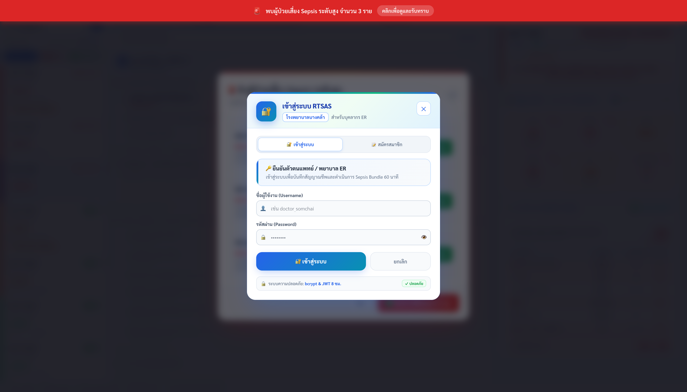
*ภาพที่ 2-1 หน้าต่างเข้าสู่ระบบ (Authentication Modal)*

### 2.1 การเข้าสู่ระบบ (Login)

**ขั้นตอน:**
1. กดปุ่ม **เข้าสู่ระบบ** ที่มุมขวาบนของ Header
2. กรอก **ชื่อผู้ใช้ (Username)** และ **รหัสผ่าน (Password)**
3. กดปุ่ม **เข้าสู่ระบบ** หรือกด Enter
4. ระบบจะตรวจสอบข้อมูลกับ Backend API และออก JWT Token อัตโนมัติ

**Auto-Login:** หากผู้ใช้เคยเข้าสู่ระบบและยังไม่ได้ออกจากระบบ เมื่อเปิดเบราว์เซอร์ครั้งถัดไปจะเข้าสู่ระบบโดยอัตโนมัติทันที ไม่ต้องกรอกรหัสผ่านใหม่

### 2.2 การสมัครสมาชิก (Register)

**ขั้นตอน:**
1. กดปุ่ม **สมัครสมาชิก** ที่มุมขวาบน
2. กรอกข้อมูลให้ครบทุกช่อง:
   - **ชื่อ** และ **นามสกุล**
   - **บทบาท (Role):** เลือก แพทย์ / พยาบาล / เจ้าหน้าที่ IT
   - **Username:** ชื่อผู้ใช้สำหรับเข้าสู่ระบบ (ตัวอักษร/ตัวเลข ไม่มีช่องว่าง)
   - **Password:** รหัสผ่าน (กรอก 2 ครั้งเพื่อยืนยัน)
3. กดปุ่ม **สมัครสมาชิก**
4. เมื่อสมัครสำเร็จ ระบบจะเปลี่ยนไปหน้าเข้าสู่ระบบโดยอัตโนมัติ

### 2.3 การออกจากระบบ (Logout)

กดปุ่ม **ออกจากระบบ** สีแดงที่ Header ระบบจะเคลียร์ JWT Token และ Session ทั้งหมดทันที

---

## 3. โครงสร้างบทบาทผู้ใช้งาน (User Roles & Permissions)

ระบบ RTSAS ใช้มาตรฐาน **Role-Based Access Control (RBAC)** เพื่อแบ่งแยกหน้าที่ตามวิชาชีพ และปกป้องข้อมูลผู้ป่วยตาม พ.ร.บ. คุ้มครองข้อมูลส่วนบุคคล (PDPA)

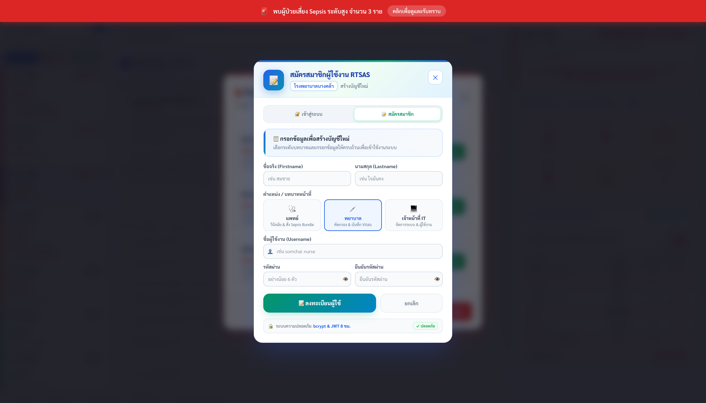
*ภาพที่ 3-1 หน้าจอเลือกบทบาทผู้ใช้งาน (Role Selection)*

### 3.1 บทบาทแพทย์ (Doctor)

| ฟังก์ชัน | รายละเอียด |
| :--- | :--- |
| **ยืนยัน Sepsis** | กดปุ่มยืนยันติดเชื้อ เพื่อเริ่มนับถอยหลัง 60 นาที |
| **Rule Out Sepsis** | กดปุ่มไม่ยืนยัน เพื่อจบกระบวนการทันที |
| **สั่งยาปฏิชีวนะตัวที่ 2** | สั่งหรือไม่สั่ง ถ้าไม่สั่ง พยาบาลกด "ข้าม" ได้ |
| **สั่งใส่สายสวนปัสสาวะ** | สั่งหรือไม่สั่ง Foley catheter |
| **ยืนยันสิ้นสุดการรักษา** | กดยืนยันสิ้นสุดกระบวนการดูแล Sepsis |

### 3.2 บทบาทพยาบาล (Nurse)

| ฟังก์ชัน | รายละเอียด |
| :--- | :--- |
| **รับแจ้งเตือน** | กด "รับทราบ" บน Alert Modal เพื่อเริ่ม Phase 1 |
| **Phase 1 Checklist** | ประเมินซ้ำ / นำเข้า ER / รายงานแพทย์ |
| **Phase 3 Bundle** | เจาะเลือดเพาะเชื้อ, ให้น้ำเกลือ, ให้ยาปฏิชีวนะ พร้อมกรอกรายละเอียด |
| **ข้ามขั้นตอนไม่บังคับ** | กดปุ่มข้ามสำหรับยาตัวที่ 2 หรือสายสวนปัสสาวะ |
| **บันทึกสัญญาณชีพซ้ำ** | กรอก RR, SpO2, SBP, DBP, HR, BT, GCS ทุก 15/30 นาที |
| **คัดลอกลง HIS** | กดคัดลอก Nursing Note ไปวางใน HOSxP |

### 3.3 บทบาทเจ้าหน้าที่ IT (IT Admin)

| ฟังก์ชัน | รายละเอียด |
| :--- | :--- |
| **ตรวจสอบ DB** | ดู HOSxP MySQL Connection Pool, Latency, Port |
| **ดูสถิติ Cache** | ตรวจสอบ Memory Cache (สัญญาณชีพ / ผู้ป่วย) |
| **ล้าง Cache** | กดล้างแคชพร้อม Safe Sepsis Guard |
| **จัดการผู้ใช้** | ดูรายชื่อผู้ใช้ทั้งหมด, ปิดใช้งานบัญชี |
| **ดาวน์โหลด System Log** | ส่งออก Log สำหรับตรวจสอบระบบ |

### 3.4 ตารางสรุปสิทธิ์การเข้าถึง (Permission Matrix)

| ฟังก์ชัน | แพทย์ | พยาบาล | IT Admin |
| :--- | :---: | :---: | :---: |
| รับทราบ Alert Modal | ✅ | ✅ | ❌ |
| ยืนยัน Sepsis (Doctor Confirm) | ✅ เฉพาะแพทย์ | ❌ | ❌ |
| Rule Out Sepsis | ✅ เฉพาะแพทย์ | ❌ | ❌ |
| บันทึก Phase 1 Checklist | ✅ | ✅ | ❌ |
| บันทึก Phase 3 Bundle | ✅ | ✅ | ❌ |
| ข้ามขั้นตอนไม่บังคับ (Skip) | ✅ | ✅ | ❌ |
| บันทึกสัญญาณชีพซ้ำ | ✅ | ✅ | ❌ |
| สิ้นสุดการรักษา | ✅ ยืนยัน | ✅ | ❌ |
| คัดลอกลง HIS | ✅ | ✅ | ❌ |
| ส่งออกรายงาน Shift (CSV/PDF) | ✅ | ✅ | ✅ |
| เข้า Admin Panel | ❌ | ❌ | ✅ เฉพาะ IT |
| ล้าง Memory Cache | ❌ | ❌ | ✅ เฉพาะ IT |
| จัดการบัญชีผู้ใช้ | ❌ | ❌ | ✅ เฉพาะ IT |

---

## 4. ภาพรวมหน้าจอหลัก (Main Dashboard Layout)

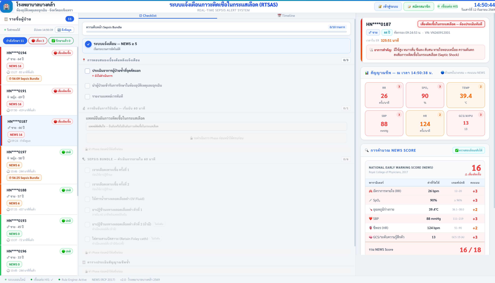
*ภาพที่ 4-1 หน้าจอหลักระบบ RTSAS (3-Column Layout)*

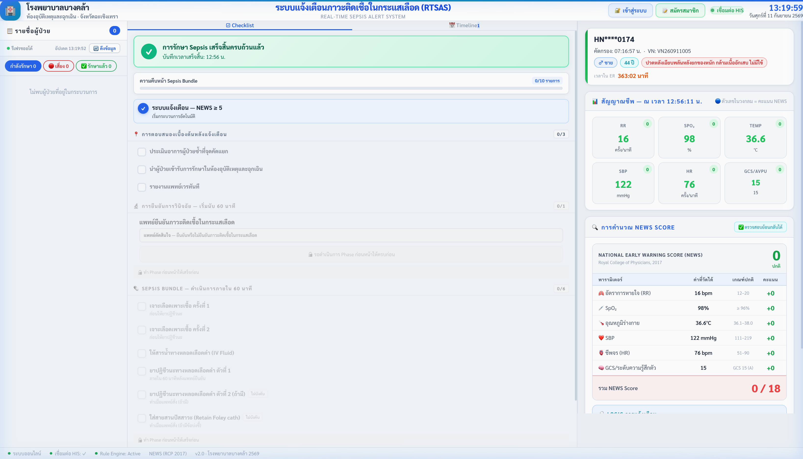
*ภาพที่ 4-2 หน้าจอระบบขณะยังไม่มีผู้ป่วยถูกเลือก (Clean Slate)*

หลังเข้าสู่ระบบสำเร็จ ผู้ใช้จะเห็นหน้าจอหลักแบ่งออกเป็น **3 คอลัมน์หลัก:**

### 4.1 คอลัมน์ซ้าย — Sidebar (แถบรายชื่อผู้ป่วย)
- รายชื่อผู้ป่วยทั้งหมดในแผนก ER เรียงตามความเร่งด่วน
- ปุ่มกรองสถานะ 3 รูปแบบ: กำลังรักษา / เสี่ยง / รักษาแล้ว
- ปุ่มดึงข้อมูลเพื่อโหลดข้อมูลใหม่จาก HOSxP

### 4.2 คอลัมน์กลาง — Workflow Panel (แผงควบคุมการรักษา)
- **Countdown Banner:** ตัวเลขนาฬิกานับถอยหลัง 60 นาที Sepsis Golden Hour
- **แท็บ Checklist:** รายการปฏิบัติการ 10 รายการใน 4 ระยะ
- **แท็บ Timeline:** ประวัติขั้นตอนการรักษาพร้อมปุ่มคัดลอกลง HIS
- **ตาราง Assessment Schedule:** รอบประเมินสัญญาณชีพซ้ำ Q15/Q30
- **ปุ่มสิ้นสุดการรักษา:** ปุ่มใหญ่สีเขียวด้านล่าง

### 4.3 คอลัมน์ขวา — Detail Panel (ข้อมูลผู้ป่วย)
- Patient Info Bar: HN Masked, เพศ, อายุ, เวลาใน ER
- Chief Complaint Box: กล่องอาการสำคัญ
- Vital Signs Grid: สัญญาณชีพ 6 พารามิเตอร์พร้อมคะแนน
- NEWS Calculation Logic: แสดงสูตรคำนวณแยกรายพารามิเตอร์

### 4.4 Header (แถบด้านบน)
- โลโก้โรงพยาบาลบางคล้า และชื่อระบบ RTSAS กลางหน้าจอ
- นาฬิกาเรียลไทม์ (อัปเดตทุกวินาที) พร้อมวันที่ภาษาไทย
- สถานะการเชื่อมต่อ HIS (เชื่อมต่อ / ไม่ได้เชื่อมต่อ)
- ปุ่มเข้าสู่ระบบ / สมัครสมาชิก / ออกจากระบบ
- ปุ่มรายงาน Shift และ Admin Panel (เฉพาะ IT Admin)

### 4.5 Status Bar (แถบด้านล่าง)
แถบสถานะแสดงข้อมูลการทำงานของระบบแบบเรียลไทม์

---

## 5. แถบรายชื่อผู้ป่วย — Sidebar Queue


*ภาพที่ 5-1 แถบรายชื่อผู้ป่วยในแผนก (Patient Queue Sidebar)*

### 5.1 การกรองรายชื่อผู้ป่วย (Filter Tabs)

| ปุ่มกรอง | ความหมาย |
| :--- | :--- |
| **กำลังรักษา** | แสดงผู้ป่วยทั้งหมดที่ยังรับการรักษาอยู่ใน ER |
| **เสี่ยง** | กรองเฉพาะผู้ป่วยที่มี NEWS >= 5 หรือมี Sepsis Alert |
| **รักษาแล้ว** | สลับไปหน้ารายงานผู้ป่วยที่สิ้นสุดการรักษาแล้ว |

### 5.2 การ์ดผู้ป่วย (Patient Card) — อ่านค่าต่างๆ

| องค์ประกอบ | ความหมาย |
| :--- | :--- |
| **HN Masked** (เช่น HN****0187) | รหัสผู้ป่วยปิดบัง 4 ตัวกลางตาม PDPA |
| **ป้ายเสี่ยงติดเชื้อ** (สีแดง) | NEWS >= 5 — ต้องดูแลด่วน |
| **ป้ายรอประเมิน** (สีขาว) | ยังไม่มีข้อมูลสัญญาณชีพ |
| **ป้ายปกติ** (สีเขียว) | NEWS 0-4 อยู่ในเกณฑ์ปกติ |
| **NEWS X** (เช่น NEWS 16) | คะแนน NEWS ปัจจุบัน |
| **เวลาที่มาถึง** | เวลาเข้า ER |
| **XX:XX Sepsis Bundle** | เวลาถอยหลัง Golden Hour ที่เหลืออยู่ |

> **เคล็ดลับ:** ป้ายเวลา Sepsis Bundle แสดงอยู่บนการ์ดตลอดเวลา ทำให้บุคลากรที่กำลังดูผู้ป่วยรายอื่นยังเห็นเวลาที่เหลืออยู่เสมอ

### 5.3 ปุ่มดึงข้อมูล

กดเพื่อสั่งให้ระบบโหลดข้อมูลสัญญาณชีพล่าสุดจากฐานข้อมูล HOSxP MySQL ทันที ใช้เมื่อต้องการตรวจสอบว่ามีผู้ป่วยใหม่เข้ามาหรือค่าสัญญาณชีพเปลี่ยนแปลง

### 5.4 การเลือกดูผู้ป่วย (Select Patient)

คลิกที่การ์ดผู้ป่วยใดๆ เพื่อโหลดข้อมูลสัญญาณชีพ, Checklist และ Timeline ของผู้ป่วยรายนั้นไปแสดงในคอลัมน์กลางและขวา

---

## 6. ระบบแจ้งเตือนฉุกเฉิน Sepsis Alert Modal

### 6.1 เมื่อไหร่ระบบจะแจ้งเตือน?

ระบบตรวจสอบคะแนน NEWS ทุกครั้งที่โหลดข้อมูล และแจ้งเตือนเมื่อ:
- **NEWS รวม >= 5** คะแนน
- **พารามิเตอร์เดี่ยวใดๆ = 3 คะแนน** (Single Parameter Alert เช่น SBP <= 90 mmHg)

### 6.2 การแจ้งเตือนแบบผู้ป่วยรายเดียว (Single Alert Modal)

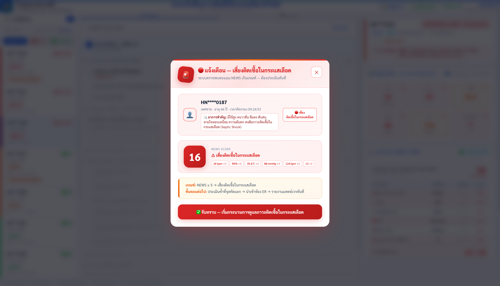
*ภาพที่ 6-1 หน้าต่างแจ้งเตือนฉุกเฉิน Sepsis (Single Alert)*

**ข้อมูลที่แสดงในหน้าต่างแจ้งเตือน:**
- ไอคอนเตือนกะพริบพร้อมเสียง (Shake Animation + Audio Chime)
- รหัส HN Masked ของผู้ป่วย, เพศ, อายุ และเวลาคัดกรอง
- **อาการสำคัญ (Chief Complaint)** เต็มๆ
- **คะแนน NEWS** ขนาดใหญ่สีแดง
- Breakdown แสดงคะแนนแยกรายพารามิเตอร์ (เช่น RR +3, SBP +3)
- คำแนะนำขั้นตอนต่อไป

**ปุ่มที่มีในหน้าต่าง:**

| ปุ่ม | การทำงาน |
| :--- | :--- |
| **รับทราบ — เริ่มกระบวนการดูแลภาวะติดเชื้อในกระแสเลือด** | ปิดป๊อปอัป เริ่ม Workflow Phase 1 และเลือกผู้ป่วยรายนี้ทันที |
| **X** (ปุ่มปิด) | ปิดหน้าต่างแต่บันทึกว่ารับทราบแล้ว ไม่แจ้งซ้ำ |

> **สำคัญ:** ทั้งการกด "รับทราบ" และปิดหน้าต่าง ระบบจะบันทึกสถานะ Dismissed ไว้ — การรีเฟรชหน้าเว็บ (F5) จะ **ไม่** เปิดหน้าต่างแจ้งเตือนซ้ำอีก (Smart Dismissal Guard)

### 6.3 การแจ้งเตือนหลายรายพร้อมกัน (Multi Alert Queue)

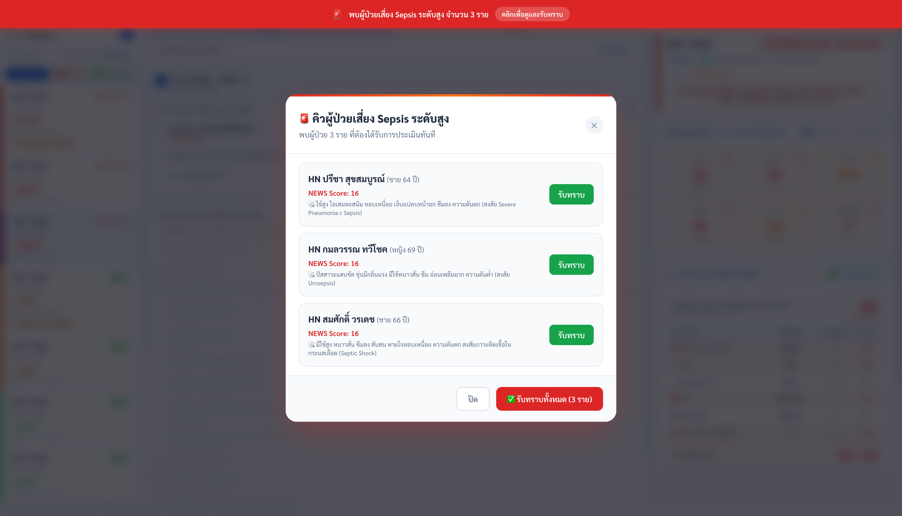
*ภาพที่ 6-2 คิวแจ้งเตือนผู้ป่วยเสี่ยงสูงหลายรายพร้อมกัน*

เมื่อมีผู้ป่วยเสี่ยงสูงหลายรายพร้อมกัน:
- ป้าย **รอแจ้งเตือนอีก X ราย** จะแสดงที่มุมขวาบน
- เมื่อกด "รับทราบ" ผู้ป่วยรายแรก ระบบจะเปิดหน้าต่างของรายต่อไปอัตโนมัติ (ใน 250ms)
- สามารถกดรับทราบทีละรายจนหมดคิว

### 6.4 Alert Summary Banner

แถบสีแดงด้านบนสุดของหน้าจอจะปรากฏเมื่อมีผู้ป่วยเสี่ยงรอการรับทราบ แสดงจำนวนผู้ป่วยที่ยังไม่ได้รับทราบ

---

## 7. ข้อมูลผู้ป่วยและสัญญาณชีพ (Patient Detail & Vitals)

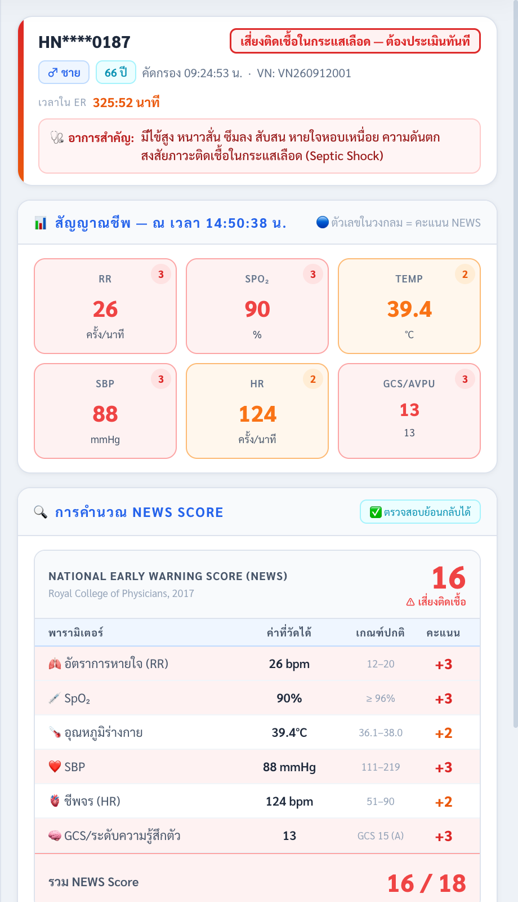
*ภาพที่ 7-1 แผงข้อมูลผู้ป่วยและสัญญาณชีพ 6 พารามิเตอร์*

### 7.1 Patient Info Bar (แถบข้อมูลผู้ป่วย)

แถบข้อมูลด้านบนของคอลัมน์ขวาแสดง:
- **HN Masked:** รหัสผู้ป่วยปิดบัง 4 หลักกลาง (เช่น HN****0187) ตามมาตรฐาน PDPA
- **เพศ:** ชาย / หญิง พร้อมสัญลักษณ์
- **อายุ:** แสดงเป็นปี
- **VN (Visit Number):** เลขครั้งที่มา
- **เวลาใน ER:** ตัวนับเวลาเดินหน้าแบบวินาทีต่อวินาที (ชั่วโมง:นาที:วินาที)

### 7.2 Chief Complaint Box (กล่องอาการสำคัญ)

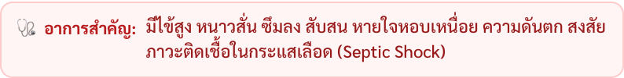
*ภาพที่ 7-2 กล่องอาการสำคัญ (Responsive Text Wrap)*

- แสดงอาการสำคัญที่บันทึกใน HOSxP ครบถ้วน
- รองรับข้อความยาว มีระบบตัดคำ (Word Wrap) อัตโนมัติ ไม่ล้นออกนอกกรอบ
- ตัวอย่าง: "ปัสสาวะแสบขัดสีขุ่น ไข้หนาวสั่น เพลียมาก หายใจเร็ว ความดันต่ำ สงสัย Urosepsis ติดเชื้อเข้ากระแสเลือด"

### 7.3 Vital Signs Grid (ตารางสัญญาณชีพ 6 ช่อง)

แต่ละช่องแสดงค่าสัญญาณชีพพร้อมคะแนน NEWS ที่ได้รับ:

| ช่อง | พารามิเตอร์ | ย่อ | เกณฑ์ปกติ (0 คะแนน) |
| :---: | :--- | :--- | :--- |
| 1 | อัตราการหายใจ | RR | 12-20 ครั้ง/นาที |
| 2 | ความอิ่มตัวออกซิเจน | SpO2 | >= 96% |
| 3 | อุณหภูมิกาย | TEMP | 36.1-38.0 องศาเซลเซียส |
| 4 | ความดันโลหิต | SBP/DBP | SBP 111-219 mmHg |
| 5 | ชีพจร | HR | 51-90 ครั้ง/นาที |
| 6 | ระดับความรู้สึกตัว | GCS/AVPU | GCS 15 = Alert |

**การแสดงสีแจ้งเตือน:**
- สีเขียว = ค่าปกติ (0 คะแนน)
- สีเหลือง = ผิดปกติเล็กน้อย (1-2 คะแนน)
- สีแดง = วิกฤต (3 คะแนน)

---

## 8. การคำนวณคะแนน NEWS (NEWS Score Logic)

### 8.1 แผงแสดงสูตรคำนวณ (NEWS Calculation Logic Panel)

แผงด้านล่างคอลัมน์ขวาแสดงรายละเอียดการคำนวณคะแนน NEWS ตามมาตรฐาน RCP 2017 แยกแจงทุกพารามิเตอร์

### 8.2 ตารางเกณฑ์คะแนน NEWS — อัตราการหายใจ (RR)

| ค่า RR | คะแนน |
| :--- | :---: |
| <= 8 ครั้ง/นาที | **3** |
| 9-11 ครั้ง/นาที | **1** |
| 12-20 ครั้ง/นาที (ปกติ) | **0** |
| 21-24 ครั้ง/นาที | **2** |
| >= 25 ครั้ง/นาที | **3** |

### 8.3 ตารางเกณฑ์คะแนน NEWS — ความอิ่มตัวออกซิเจน (SpO2)

| ค่า SpO2 | คะแนน |
| :--- | :---: |
| <= 91% | **3** |
| 92-93% | **2** |
| 94-95% | **1** |
| >= 96% (ปกติ) | **0** |

### 8.4 ตารางเกณฑ์คะแนน NEWS — อุณหภูมิกาย (Temperature)

| ค่าอุณหภูมิ | คะแนน |
| :--- | :---: |
| <= 35.0 องศาเซลเซียส | **3** |
| 35.1-36.0 องศาเซลเซียส | **1** |
| 36.1-38.0 องศาเซลเซียส (ปกติ) | **0** |
| 38.1-39.0 องศาเซลเซียส | **1** |
| > 39.0 องศาเซลเซียส | **2** |

### 8.5 ตารางเกณฑ์คะแนน NEWS — ความดันโลหิต Systolic (SBP)

| ค่า SBP | คะแนน |
| :--- | :---: |
| <= 90 mmHg | **3** |
| 91-100 mmHg | **2** |
| 101-110 mmHg | **1** |
| 111-219 mmHg (ปกติ) | **0** |
| >= 220 mmHg | **3** |

### 8.6 ตารางเกณฑ์คะแนน NEWS — ชีพจร (HR)

| ค่า HR | คะแนน |
| :--- | :---: |
| <= 40 ครั้ง/นาที | **3** |
| 41-50 ครั้ง/นาที | **1** |
| 51-90 ครั้ง/นาที (ปกติ) | **0** |
| 91-110 ครั้ง/นาที | **1** |
| 111-130 ครั้ง/นาที | **2** |
| >= 131 ครั้ง/นาที | **3** |

### 8.7 ตารางเกณฑ์คะแนน NEWS — ระดับความรู้สึกตัว (GCS -> AVPU)

| GCS | AVPU | คะแนน |
| :--- | :--- | :---: |
| **15** | **A (Alert)** | **0** |
| 9-14 | V (Voice) | **3** |
| 4-8 | P (Pain) | **3** |
| 3 | U (Unresponsive) | **3** |

### 8.8 ตีความคะแนน NEWS รวม

| คะแนนรวม | ระดับความเสี่ยง | การจัดการ |
| :---: | :--- | :--- |
| **0** | ปกติ | ติดตามตามปกติ |
| **1-4** | ต่ำ | ประเมินซ้ำตามกำหนด |
| **5-6** | ปานกลาง | แจ้งเตือน Sepsis ต้องประเมินด่วน |
| **>= 7** | สูง | Sepsis วิกฤต ต้องการการดูแลเร่งด่วน |

---

## 9. Sepsis Bundle Checklist — 4 ระยะการรักษา

Checklist แบ่งการรักษาออกเป็น **4 ระยะ (Phases)** ตาม 1-Hour Sepsis Bundle แต่ละ Phase จะถูกปลดล็อคเมื่อทำ Phase ก่อนหน้าเสร็จสมบูรณ์

### 9.1 แถบความคืบหน้า (Progress Bar)

ด้านบนของ Checklist แสดงแถบสีน้ำเงิน-ฟ้าที่บ่งบอกความคืบหน้าทั้งหมด เช่น "7/10 รายการ" พร้อมเปอร์เซ็นต์

---

### Phase 1: การตอบสนองเบื้องต้นหลังแจ้งเตือน (Initial Response)

*ปลดล็อคทันทีเมื่อกดรับทราบ Alert Modal*

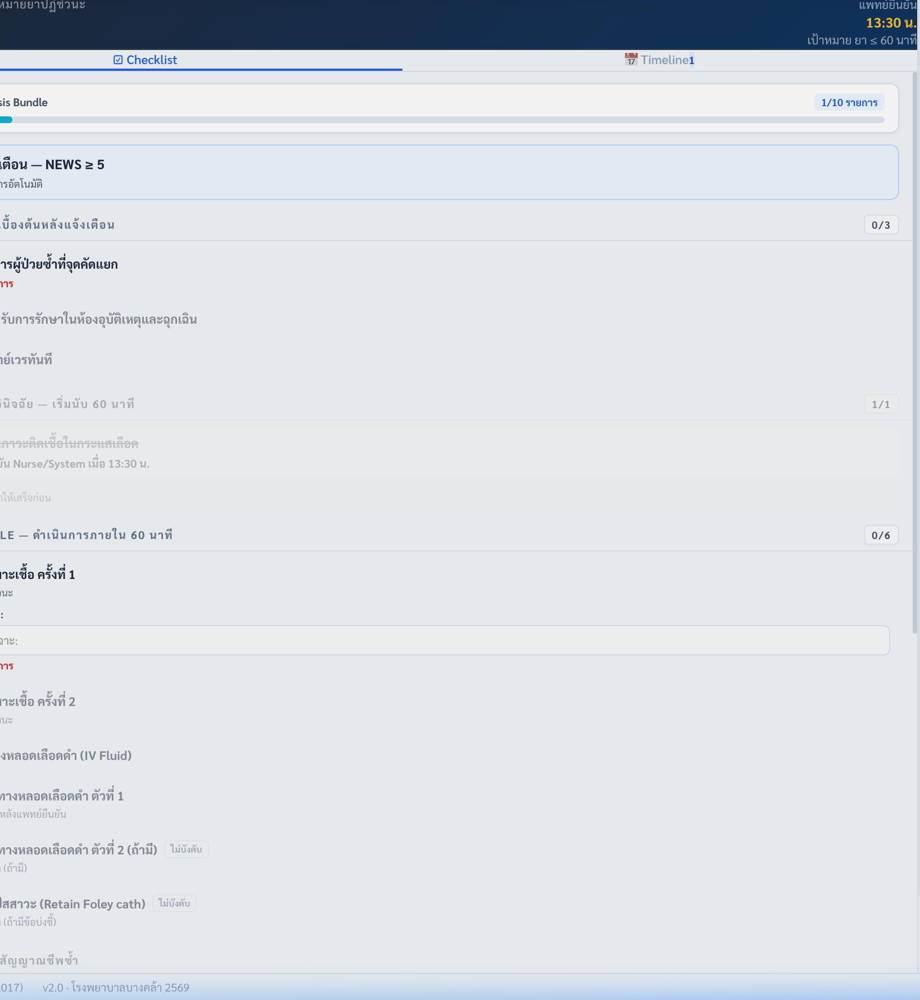
*ภาพที่ 9-1 กระบวนการทำงาน 4 ระยะ*

| รายการ | ผู้รับผิดชอบ | วิธีใช้ |
| :--- | :---: | :--- |
| **ประเมินอาการผู้ป่วยซ้ำที่จุดคัดแยก (Triage Assessment)** | พยาบาล | คลิกที่รายการเพื่อติ๊กสำเร็จ |
| **นำผู้ป่วยเข้ารับการรักษาในห้องอุบัติเหตุและฉุกเฉิน (ER Admission)** | พยาบาล | คลิกเพื่อบันทึก |
| **รายงานแพทย์เวรทันที (Initial Report)** | พยาบาล | คลิกเพื่อบันทึก |

---

### Phase 2: การยืนยันการวินิจฉัยโดยแพทย์ (Doctor Confirmation)

*ปลดล็อคเมื่อ Phase 1 ครบทุกรายการ*


*ภาพที่ 9-2 หน้าต่างตัดสินใจของแพทย์ใน Phase 2*

**แพทย์เวรตัดสินใจผ่าน 2 ตัวเลือก:**

#### ปุ่มแดง: ยืนยัน — ติดเชื้อ เริ่มนับ 60 นาที
1. กดปุ่มแดง → ระบบแสดงหน้าต่างยืนยันซ้ำ (Double Confirmation)
2. กด **ยืนยัน — เริ่มนับ 60 นาที** เพื่อยืนยัน
3. ผลที่เกิดขึ้น:
   - ตัวนับถอยหลัง 60:00 นาทีเริ่มทำงาน (แสดงบน Countdown Banner)
   - Phase 3 (Sepsis Bundle) ถูกปลดล็อค
   - ตาราง Assessment Schedule Phase 4 ถูกสร้างอัตโนมัติ
   - Timeline บันทึก "แพทย์ยืนยันภาวะติดเชื้อในกระแสเลือด — เริ่มนับ 60 นาที"

#### ปุ่มเขียว: ไม่ยืนยัน — Rule Out จบกระบวนการ
1. กดปุ่มเขียว → ระบบแสดงหน้าต่างยืนยันซ้ำ
2. กด **ยืนยัน — ไม่ใช่ภาวะติดเชื้อ** เพื่อยืนยัน
3. ผลที่เกิดขึ้น:
   - กระบวนการ Sepsis Bundle สิ้นสุดทันที
   - แสดงแบนเนอร์สีเขียว "แพทย์ยืนยัน Ruled Out Sepsis แล้ว"
   - ผู้ป่วยย้ายไปแท็บ "รักษาแล้ว" พร้อม Outcome = "Ruled Out"

---

### Phase 3: SEPSIS BUNDLE — ดำเนินการภายใน 60 นาที

*ปลดล็อคเมื่อแพทย์กด "ยืนยัน Sepsis"*


*ภาพที่ 9-3 รายการ Sepsis Bundle พร้อมช่องกรอกข้อมูล*

#### 9.3.1 เจาะเลือดเพาะเชื้อ ครั้งที่ 1 (Hemoculture 1) — [บังคับ]
1. ทำก่อนให้ยาปฏิชีวนะเสมอ
2. กรอกช่องข้อความ **ตำแหน่งที่เจาะ:** (เช่น Left median cubital vein)
3. กดปุ่ม **บันทึก** สีน้ำเงิน → ระบบติ๊กและบันทึก Timeline

#### 9.3.2 เจาะเลือดเพาะเชื้อ ครั้งที่ 2 (Hemoculture 2) — [บังคับ]
1. กรอกช่อง **ตำแหน่งที่เจาะ:** (เช่น Right cephalic vein)
2. กดปุ่ม **บันทึก** → บันทึก Timeline

#### 9.3.3 ให้สารน้ำทางหลอดเลือดดำ (IV Fluid) — [บังคับ]
1. กรอกช่อง **ชนิดสารน้ำ / อัตราเร็ว:** (เช่น NSS 1,000 ml IV load in 1 hr)
2. กดปุ่ม **บันทึก** → บันทึก Timeline

#### 9.3.4 ยาปฏิชีวนะทางหลอดเลือดดำ ตัวที่ 1 (Antibiotics #1) — [บังคับ]
1. ต้องให้ภายใน 60 นาทีหลังยืนยัน Sepsis
2. กรอกช่อง **ชนิดยา / ขนาด / วิธีให้:** (เช่น Ceftriaxone 2g IV drip in 30 min)
3. กดปุ่ม **บันทึก** → บันทึก Timeline

#### 9.3.5 ยาปฏิชีวนะทางหลอดเลือดดำ ตัวที่ 2 (Antibiotics #2) — [ไม่บังคับ]
- **หากแพทย์สั่ง:** กรอกช่องข้อมูลยา → กด บันทึก
- **หากไม่มีคำสั่งแพทย์:** กดปุ่ม **ข้ามขั้นตอนนี้ — ไม่มียาตัวที่ 2**
  - ระบบบันทึกสถานะ "ข้าม" พร้อมเวลา และแสดงใน Timeline ว่า "ข้าม: ยาปฏิชีวนะตัวที่ 2 (ไม่มีคำสั่งแพทย์)"

#### 9.3.6 ใส่สายสวนปัสสาวะ (Retain Foley Catheter) — [ไม่บังคับ]
- **หากมีข้อบ่งชี้:** กรอกข้อมูลตามที่แพทย์สั่ง → กด บันทึก
- **หากไม่มีข้อบ่งชี้:** กดปุ่ม **ข้ามขั้นตอนนี้**

> **หมายเหตุ:** การข้าม (Skip) ขั้นตอนไม่บังคับ **ไม่ทำให้ Bundle ผิดพลาด** ระบบออกแบบมาให้พยาบาลสามารถดำเนินการได้อย่างถูกต้องตามมาตรฐาน

---

### Phase 4: ตารางประเมินสัญญาณชีพซ้ำ (Assessment Schedule)

สร้างอัตโนมัติเมื่อแพทย์ยืนยัน Sepsis — ดูรายละเอียดใน บทที่ 10

---

## 10. ตารางติดตามสัญญาณชีพซ้ำ (Reassessment Schedule)

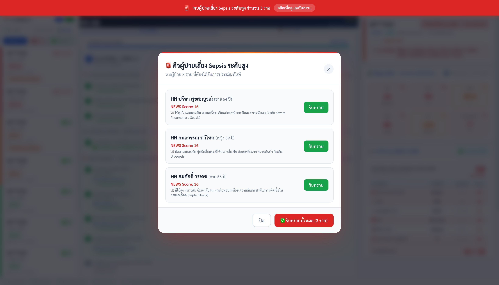
*ภาพที่ 10-1 ตารางการติดตามสัญญาณชีพ Q15 และ Q30*

### 10.1 รอบเวลาการติดตาม (Schedule Rules)

| รอบ | ความถี่ | เวลา | จำนวน |
| :---: | :--- | :--- | :---: |
| รอบที่ 1-4 | ทุก 15 นาที (Q15) | T+15, T+30, T+45, T+60 | 4 ครั้ง |
| รอบที่ 5 ขึ้นไป | ทุก 30 นาที (Q30) | T+90, T+120, T+150... | ต่อเนื่อง |

T = เวลาที่แพทย์กดยืนยัน Sepsis

### 10.2 สถานะในตาราง

| สถานะ | ความหมาย |
| :--- | :--- |
| ✓ บันทึกแล้ว (สีเขียว) | กรอกสัญญาณชีพและบันทึกเรียบร้อย แสดงคะแนน NEWS |
| รอ Phase 3 | รอให้ Sepsis Bundle ครบก่อน |
| รอครั้งก่อนหน้า | ล็อคจนกว่าจะบันทึกรอบก่อนหน้าเสร็จ |
| บันทึก (สีฟ้า) | พร้อมบันทึก กดเปิด Assessment Form Modal |
| บันทึกด่วน (สีแดง กะพริบ) | เลยเวลาเป้าหมายแล้ว ต้องบันทึกด่วน |
| เสร็จตรงนี้ | รอบที่ยุติเพราะสิ้นสุดการรักษา |
| ยกเลิก | รอบที่ยกเลิกเพราะสิ้นสุดการรักษาก่อนถึงกำหนด |

### 10.3 วิธีบันทึกสัญญาณชีพในตาราง

1. กดปุ่ม **บันทึก** หรือ **บันทึกด่วน** ที่แถวรอบนั้น
2. ระบบเปิดหน้าต่าง Assessment Form Modal (ดูบทที่ 11)
3. กรอกสัญญาณชีพและกด **บันทึกการประเมิน**

---

## 11. แบบฟอร์มบันทึกสัญญาณชีพ (Assessment Form Modal)

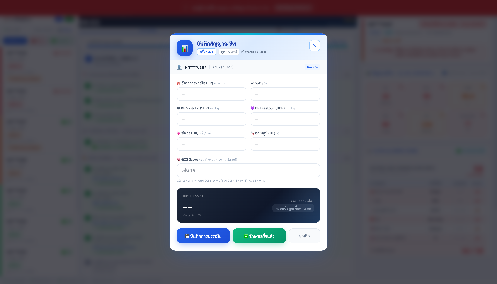
*ภาพที่ 11-1 แบบฟอร์มบันทึกสัญญาณชีพพร้อม Live NEWS Score*

### 11.1 การเปิดหน้าต่าง

หน้าต่างนี้เปิดได้ 2 ทาง:
1. กดปุ่ม "บันทึก" / "บันทึกด่วน" ในตาราง Assessment Schedule
2. กดปุ่ม "บันทึกสัญญาณชีพ" ใน Reminder Modal (กระดิ่งเตือน)

### 11.2 ข้อมูลที่แสดงในหัว Modal

- **ครั้งที่:** เช่น 2/4 (รอบที่ 2 ของ 4 รอบ Q15)
- **ความถี่:** ทุก 15 นาที หรือ ทุก 30 นาที
- **เป้าหมาย:** เวลาเป้าหมายที่ต้องกรอก
- **ผู้ป่วย:** HN Masked, เพศ, อายุ
- **ตัวนับ:** X/6 ช่อง บอกว่ากรอกไปแล้วกี่ช่อง

### 11.3 ช่องกรอกสัญญาณชีพ (6 พารามิเตอร์)

| ช่อง | พารามิเตอร์ | หน่วย | ช่วงที่รับได้ |
| :--- | :--- | :--- | :--- |
| อัตราการหายใจ (RR) | ครั้ง/นาที | ครั้ง/นาที | 1-60 |
| SpO2 | % | % | 50-100 |
| BP Systolic (SBP) | mmHg | mmHg | 40-300 |
| BP Diastolic (DBP) | mmHg | mmHg | 20-200 |
| ชีพจร (HR) | ครั้ง/นาที | ครั้ง/นาที | 20-250 |
| อุณหภูมิ (BT) | องศาเซลเซียส | °C | 30-43 (ระบุทศนิยม 1 ตำแหน่ง) |

### 11.4 การกรอก GCS และการแปลง AVPU อัตโนมัติ

กรอกค่า **GCS (3-15)** ในช่อง GCS Score

ระบบแปลงเป็น AVPU ให้อัตโนมัติ:

| GCS ที่กรอก | AVPU ที่แสดง | คะแนน NEWS |
| :---: | :--- | :---: |
| **15** | A — Alert (สีเขียว) | +0 |
| 9-14 | V — Voice (สีเหลือง) | +3 |
| 4-8 | P — Pain (สีส้ม) | +3 |
| 3 | U — Unresponsive (สีแดง) | +3 |

### 11.5 Live NEWS Score Card

ด้านล่างช่องกรอก มีบัตรคะแนน **NEWS สด (Live Calculation):**
- แสดงคะแนนรวมขนาดใหญ่ เช่น 7
- แสดงสูตรแยกรายพารามิเตอร์ เช่น RR(2) + SpO2(1) + Temp(1) + SBP(2) + HR(1) + GCS15->A(0) = 7
- ระดับสีตามความเสี่ยง: สีเขียว (ปกติ) / สีส้ม (ปานกลาง) / สีแดง (สูง)

### 11.6 ปุ่มในแบบฟอร์ม

| ปุ่ม | การทำงาน |
| :--- | :--- |
| **บันทึกการประเมิน** | บันทึกสัญญาณชีพลงระบบ อัปเดตตาราง บันทึก Timeline |
| **รักษาเสร็จแล้ว** | เปิดหน้ายืนยันสิ้นสุดการรักษา (ต้องกดยืนยันอีกครั้ง) |
| **ยกเลิก** | ปิดหน้าต่างโดยไม่บันทึก ข้อมูลที่กรอกหายทั้งหมด |

> **คำเตือน:** กดปุ่ม "รักษาเสร็จแล้ว" แล้วกด "ยืนยันเสร็จสิ้น" จะสิ้นสุดการรักษาทันที ไม่สามารถยกเลิกได้

---

## 12. กระดิ่งเตือนรอบประเมิน (Reminder Modal)

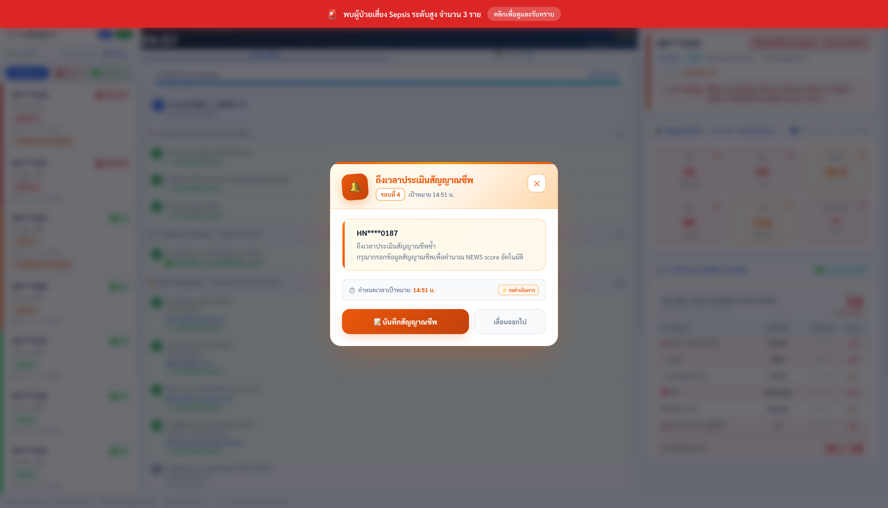
*ภาพที่ 12-1 หน้าต่างกระดิ่งเตือนเมื่อถึงกำหนดรอบประเมิน*

### 12.1 เมื่อไหร่กระดิ่งจะดัง?

ระบบส่งสัญญาณเตือนและแสดงหน้าต่างสีส้มเมื่อถึงเวลาเป้าหมายของแต่ละรอบ:
- รอบที่ 1: นาทีที่ 15 หลังเริ่ม
- รอบที่ 2: นาทีที่ 30
- รอบที่ 3: นาทีที่ 45
- รอบที่ 4: นาทีที่ 60
- รอบที่ 5 เป็นต้นไป: ทุก 30 นาที

### 12.2 ปุ่มในหน้าต่างกระดิ่งเตือน

| ปุ่ม | การทำงาน |
| :--- | :--- |
| **บันทึกสัญญาณชีพ** | ปิดกระดิ่ง และเปิด Assessment Form Modal ทันที |
| **เลื่อนออกไป** | ปิดกระดิ่งชั่วคราว ไม่เปิด Form (ใช้เมื่อติดหัตถการวิกฤต) |
| **X** (ปุ่มปิด) | เหมือน "เลื่อนออกไป" |

---

## 13. การสิ้นสุดการรักษา (Treatment Complete)

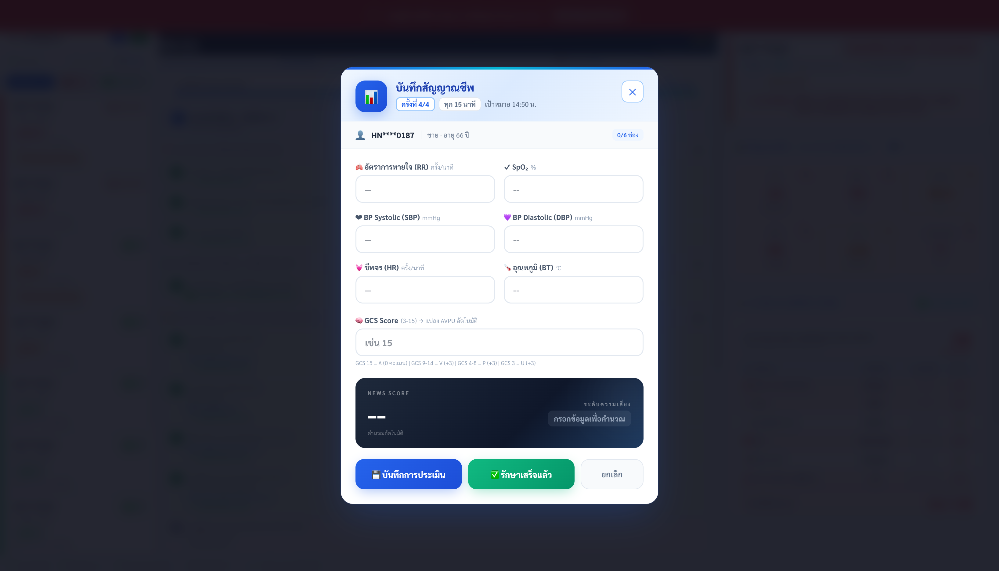
*ภาพที่ 13-1 หน้าต่างยืนยันการสิ้นสุดการรักษา*

### 13.1 วิธีสิ้นสุดการรักษา

**ทางที่ 1: ปุ่มด้านล่าง Checklist**
1. กดปุ่ม **สิ้นสุดการรักษา (รักษาเสร็จแล้ว)** ที่ด้านล่างสุดของ Checklist
2. ระบบแสดง Confirmation Modal ให้ยืนยัน
3. กด **ยืนยันเสร็จสิ้น** เพื่อยืนยัน

**ทางที่ 2: ปุ่มใน Assessment Form Modal**
1. กดปุ่ม **รักษาเสร็จแล้ว** → กด **ยืนยันเสร็จสิ้น**

### 13.2 ผลที่เกิดขึ้นเมื่อสิ้นสุดการรักษา

- ตัวนับเวลา 60 นาทีหยุดทำงานทันที
- แบนเนอร์สีเขียว "การรักษา Sepsis เสร็จสิ้นครบถ้วนแล้ว" แสดงใน Checklist
- บันทึกเวลาที่เสร็จสิ้น (เช่น บันทึกเวลาเสร็จสิ้น: 11:07 น.)
- Checklist เข้าสู่โหมดอ่านอย่างเดียว ไม่สามารถแก้ไขได้
- ผู้ป่วยย้ายไปแท็บ "รักษาแล้ว" ใน Sidebar

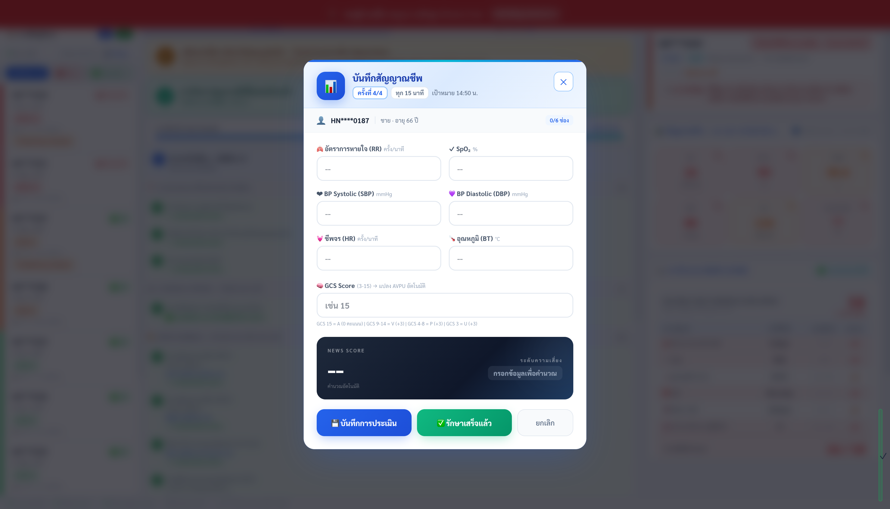
*ภาพที่ 13-2 สถานะสิ้นสุดการรักษาสมบูรณ์ (Green Banner)*

### 13.3 โหมดประวัติย้อนหลัง (Historical Read-Only Mode)

เมื่อเปิดดูผู้ป่วยที่สิ้นสุดการรักษาแล้ว ระบบแสดง:
- **แถบสีทอง** ด้านบนแจ้งว่า "กำลังดูประวัติย้อนหลัง (โหมดอ่านอย่างเดียว)"
- รหัส HN และวัน/เวลาที่เข้ารับบริการ
- ป้ายสถานะ: สิ้นสุดการรักษา หรือ Rule Out Sepsis
- ข้อความ "ข้อมูลถูกล็อคถาวรเพื่อรักษาความเป็นกลางของเวชระเบียน"
- ปุ่ม **กลับหน้ารายงานผู้ป่วยที่รักษาแล้ว**

---

## 14. ไทม์ไลน์คลินิกและการส่งออก HIS (Timeline & HIS Copy)

### 14.1 แท็บ Timeline


*ภาพที่ 14-1 แถบไทม์ไลน์บันทึกขั้นตอนการรักษา*

กดแท็บ **Timeline** ที่คอลัมน์กลาง เพื่อดูประวัติขั้นตอนการรักษาทั้งหมด

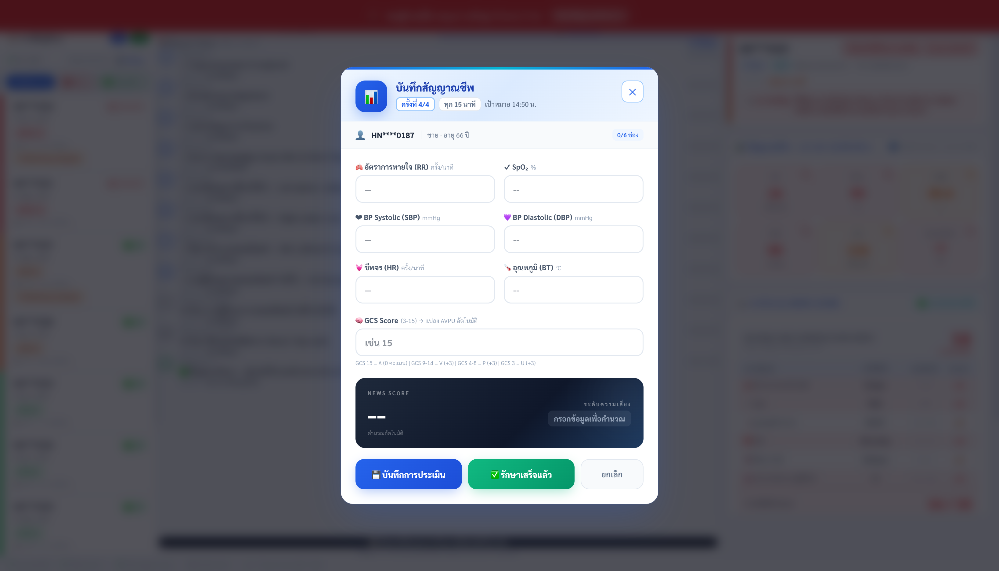
*ภาพที่ 14-2 ตัวอย่าง Timeline ครบถ้วน 11 ขั้นตอน*

**ข้อมูลในแต่ละรายการ:**
- **หมายเลขขั้นตอน** (เช่น ขั้นตอนที่ 5)
- **เวลา (timestamp)** ระดับวินาที (เช่น 10:07:54)
- **คำอธิบายขั้นตอน** (เช่น เจาะเลือดเพาะเชื้อ ครั้งที่ 1 — Left median cubital vein)
- **ผู้ปฏิบัติ** (เช่น พย.สุกัญญา หรือ นพ.เกียรติศักดิ์)

**สีของป้ายขั้นตอน:**
- สีเขียว = ทำสำเร็จ
- สีน้ำเงิน = ปกติ
- สีส้ม = สำคัญ
- สีแดง = วิกฤต/เร่งด่วน
- สีเทา = ข้าม (Skipped)

**ตัวนับขั้นตอน:** ด้านบน Timeline แสดง "X ขั้นตอน" รวมทั้งหมด

### 14.2 ฟังก์ชันคัดลอกลง HIS

กดปุ่ม **คัดลอกขั้นตอนการรักษาเพื่อบันทึกใน HIS** ที่ด้านล่างแท็บ Timeline

ระบบจะรวบรวมขั้นตอนทั้งหมดและจัดรูปแบบเป็น Nursing Note มาตรฐาน:

```
=== บันทึกการดูแลรักษาภาวะติดเชื้อในกระแสเลือด (RTSAS Sepsis Note) ===
ผู้ป่วย: HN****0187 | วันที่: 12/09/2569
- 10:07:52 น. [ขั้นตอนที่ 1] Triage Assessment Completed (ผู้ปฏิบัติ: พย.สุกัญญา)
- 10:07:52 น. [ขั้นตอนที่ 2] ER Admission Registered (ผู้ปฏิบัติ: พย.สุกัญญา)
- 10:07:52 น. [ขั้นตอนที่ 3] Initial Report to Physician (ผู้ปฏิบัติ: พย.สุกัญญา)
- 10:07:53 น. [ขั้นตอนที่ 4] แพทย์ยืนยันภาวะติดเชื้อในกระแสเลือด — เริ่มนับ 60 นาที (นพ.เกียรติศักดิ์)
- 10:07:54 น. [ขั้นตอนที่ 5] เจาะเลือดเพาะเชื้อ ครั้งที่ 1 — Left median cubital vein (พย.สุกัญญา)
- 10:07:54 น. [ขั้นตอนที่ 6] เจาะเลือดเพาะเชื้อ ครั้งที่ 2 — Right cephalic vein (พย.สุกัญญา)
- 10:07:54 น. [ขั้นตอนที่ 7] ให้สารน้ำทางหลอดเลือดดำ — NSS 1,000 ml IV load in 1 hr (พย.สุกัญญา)
- 10:07:54 น. [ขั้นตอนที่ 8] ยาปฏิชีวนะทางหลอดเลือดดำ ตัวที่ 1 — Ceftriaxone 2g IV drip in 30 min (พย.สุกัญญา)
- 10:07:54 น. [ขั้นตอนที่ 9] ข้าม: ยาปฏิชีวนะตัวที่ 2 (ไม่มีคำสั่งแพทย์)
- 10:07:54 น. [ขั้นตอนที่ 10] ข้าม: ใส่สายสวนปัสสาวะ (ไม่มีข้อบ่งชี้)
- 10:07:55 น. [ขั้นตอนที่ 11] สิ้นสุดการรักษา — ผู้ป่วยได้รับการรักษาครบถ้วนแล้ว
============================================================
```

**วิธีวางใน HOSxP:**
1. กดปุ่ม **คัดลอก...** → ระบบแจ้ง "คัดลอกขั้นตอนการรักษาสำเร็จ — พร้อมวางใน HIS"
2. เปิดโปรแกรม HOSxP ไปที่หน้าบันทึกการพยาบาล (Nursing Note)
3. กด **Ctrl + V** เพื่อวาง

---

## 15. แดชบอร์ดผู้ป่วยที่รักษาแล้ว (Treated Cases Dashboard)

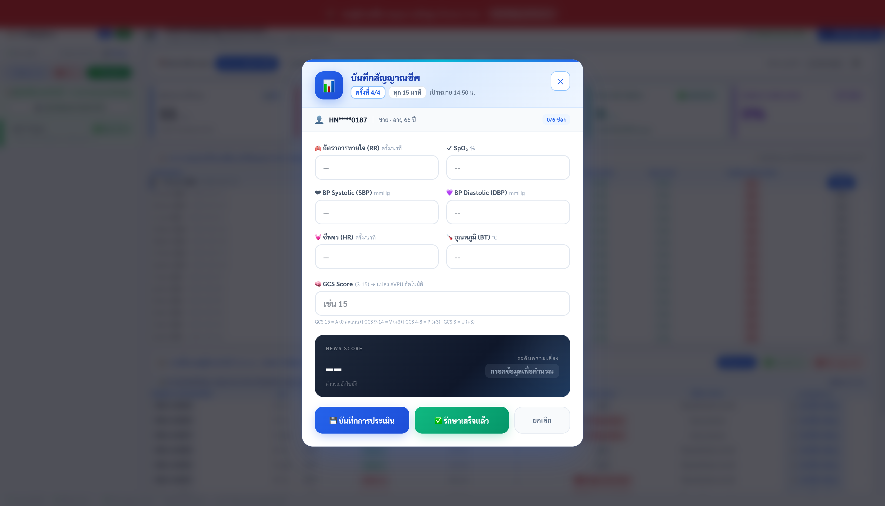
*ภาพที่ 15-1 แดชบอร์ดสรุปสถิติผู้ป่วยที่รักษาแล้ว*

### 15.1 วิธีเข้าถึง

- กดแท็บ **รักษาแล้ว** ใน Sidebar
- หรือกดปุ่ม **กลับหน้ารายงานผู้ป่วยที่รักษาแล้ว** บนแถบทอง (ขณะดูประวัติย้อนหลัง)

### 15.2 การเลือกวันที่ดูรายงาน

กดปุ่มลูกศรซ้าย/ขวา หรือเลือกวันที่จาก Dropdown เพื่อดูสถิติย้อนหลัง

### 15.3 KPI Cards (ตัวชี้วัดคุณภาพ)

แสดงสถิติสำหรับวันที่เลือก:

| KPI | ความหมาย |
| :--- | :--- |
| **ผู้ป่วยทั้งหมด** | จำนวน Visit ในวันนั้น |
| **เสี่ยงสูง (High Risk)** | ผู้ป่วยที่มี NEWS >= 5 หรือมี Sepsis Alert |
| **รักษาสำเร็จ (Treated)** | เคสที่สิ้นสุดการรักษา Sepsis Bundle ครบ |
| **Rule Out** | เคสที่แพทย์วินิจฉัยไม่ใช่ Sepsis |
| **Compliance Rate (%)** | อัตราความสอดคล้องตามมาตรฐาน |

### 15.4 ตารางประวัติรายบุคคล (Case History Table)

แสดงรายชื่อผู้ป่วยแต่ละราย:
- HN Masked, เพศ, อายุ
- คะแนน NEWS
- วันและเวลาที่มาถึง
- เวลาที่รักษาเสร็จ
- ผู้ดูแล (Treated By)
- **Outcome Label:** รักษาสำเร็จ / Rule Out / กำลังรักษา

### 15.5 ตัวกรองข้อมูลในตาราง

กดปุ่มตัวกรองเพื่อแสดงเฉพาะ:
- **ทั้งหมด** — แสดงผู้ป่วยทุกราย
- **รักษาสำเร็จ** — เฉพาะเคสที่สิ้นสุดการรักษาแล้ว
- **เสี่ยงสูง** — เฉพาะเคสที่มี NEWS >= 5

### 15.6 ปุ่ม "ดู Timeline" — เปิดดูประวัติการรักษา

กดปุ่มนี้ในแถวผู้ป่วยใดๆ เพื่อเปิด Clinical Treatment Timeline Modal ในหน้า Dashboard นี้เลย:
- แสดงอาการสำคัญ (Chief Complaint)
- สัญญาณชีพแรกรับ (First Vitals)
- ลำดับขั้นตอนการรักษาทั้งหมด
- ปุ่ม **คัดลอกลง HIS**

### 15.7 ปุ่ม "เปิดในหน้าจอหลัก (Bedside Monitoring)"

กดเพื่อสลับไปยัง Clinical Dashboard และเปิดผู้ป่วยรายนั้นในโหมดประวัติย้อนหลัง (Read-Only) พร้อมแถบสีทอง

### 15.8 ปุ่ม "กลับหน้าหลัก"

กดเพื่อกลับไปยัง Clinical Dashboard หน้าจอหลัก

---

## 16. การออกรายงานประจำ Shift (Export Report)

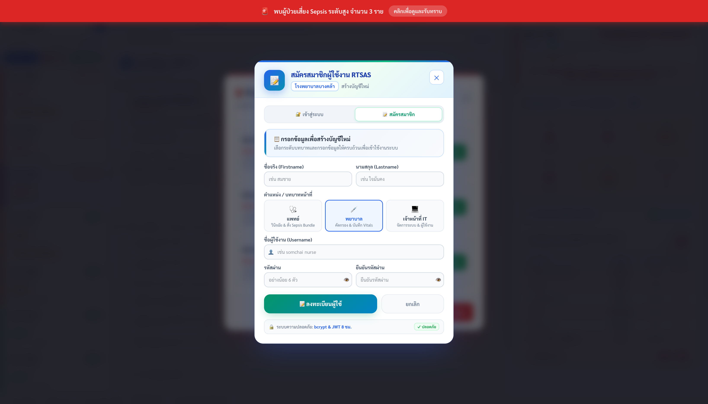
*ภาพที่ 16-1 หน้าต่างออกรายงานสรุปประจำ Shift*

### 16.1 วิธีเปิดหน้าต่างรายงาน

กดปุ่ม **รายงาน Shift** บน Header (ปุ่มสีเขียว มองเห็นเฉพาะเมื่อ Login แล้ว)

### 16.2 การเลือก Shift

กดเลือก Shift ที่ต้องการออกรายงาน (ระบบเลือก Shift ปัจจุบันให้อัตโนมัติ):

| Shift | ช่วงเวลา |
| :--- | :--- |
| **เช้า** | 07:00 - 15:00 |
| **บ่าย** | 15:00 - 23:00 |
| **ดึก** | 23:00 - 07:00 |

### 16.3 สรุปสถิติ Shift (4 ตัวชี้วัด)

| ตัวชี้วัด | ความหมาย |
| :--- | :--- |
| **ผู้ป่วยใน Shift** | จำนวนผู้ป่วยทั้งหมดในช่วงเวลานั้น |
| **ยืนยัน Sepsis** | เคสที่แพทย์ยืนยันภาวะติดเชื้อในกระแสเลือด |
| **เวลา Bundle เฉลี่ย** | เฉลี่ยนาทีที่ใช้ดำเนิน Sepsis Bundle |
| **เช็คลิสต์ครบเฉลี่ย (%)** | ค่าเฉลี่ยเปอร์เซ็นต์รายการที่ทำครบ |

นอกจากนี้ยังแสดง:
- **วันที่รายงาน**
- **จำนวน Rule Out Cases**

### 16.4 ปุ่มส่งออก

| ปุ่ม | รูปแบบ | การใช้งาน |
| :--- | :--- | :--- |
| **ดาวน์โหลด CSV** | Excel/CSV | เปิดใน Excel, Google Sheets เพื่อวิเคราะห์ต่อ |
| **PDF** | PDF | เปิดหน้าต่างพิมพ์ของเบราว์เซอร์สำหรับบันทึก PDF |

---

## 17. หน้าจัดการระบบสำหรับ IT Admin (Admin Panel)

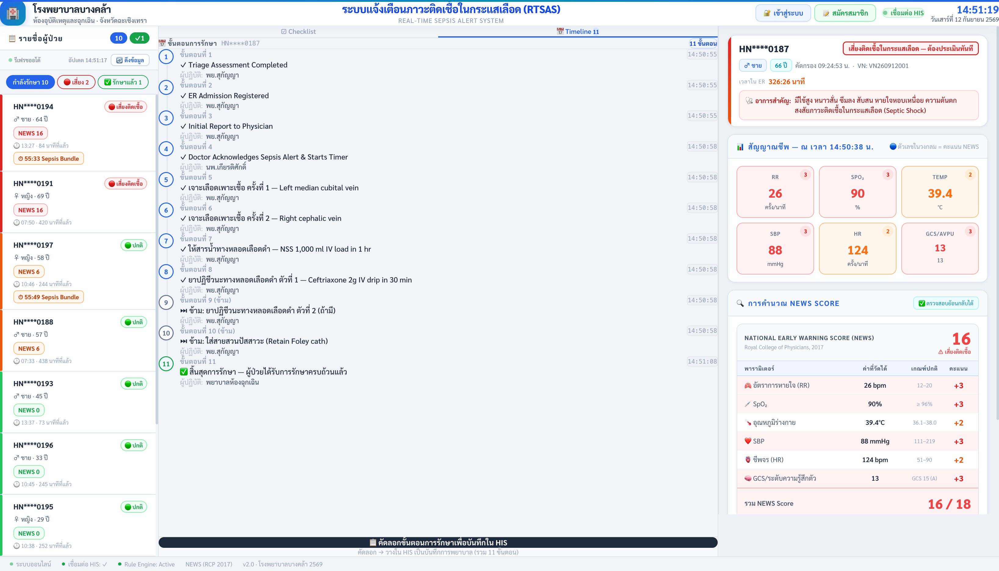
*ภาพที่ 17-1 หน้าจัดการระบบ IT Admin Panel*

### 17.1 วิธีเข้าถึง Admin Panel

กดปุ่ม **Admin Panel** บน Header (แสดงเฉพาะเมื่อ Login ด้วยบทบาท IT Admin)

### 17.2 ส่วนที่ 1: System Status (สถานะระบบ)

**HOSxP Database Connection:**
| ข้อมูล | ความหมาย |
| :--- | :--- |
| Connection Status | Connected / Disconnected |
| Pool Available | จำนวน Connection ที่พร้อมใช้งาน |
| Host / Port | ที่อยู่และพอร์ตฐานข้อมูล HOSxP |
| Database Name | ชื่อฐานข้อมูล |
| Ping Latency | ความเร็วการตอบสนอง (ms) |

**Auth Database:**
สถานะการเชื่อมต่อฐานข้อมูลบัญชีผู้ใช้งาน

### 17.3 ส่วนที่ 2: Cache Statistics (สถิติหน่วยความจำ)

| ข้อมูล | ความหมาย |
| :--- | :--- |
| **Vitals Cache Count** | จำนวนชุดสัญญาณชีพที่เก็บในหน่วยความจำ |
| **Patients Cache Count** | จำนวนผู้ป่วยที่เก็บในหน่วยความจำ |
| **Last Clear Date** | วันที่ล้าง Cache ครั้งล่าสุด |

### 17.4 ส่วนที่ 3: System Tools — ล้างแคช (Safe Sepsis Guard)

เมื่อกดปุ่ม **ล้างแคชทั้งหมด** ระบบแสดงหน้าต่างยืนยันพร้อมแสดง:
- **จำนวนผู้ป่วยที่กำลังรักษาอยู่** (กลุ่มนี้จะ **ไม่ถูกล้าง** — Safe Sepsis Guard)
- **จำนวนผู้ป่วยที่ไม่ได้รักษา** (กลุ่มนี้จะถูกล้าง)

**ขั้นตอนล้าง Cache:**
1. กดปุ่ม **ล้างแคชทั้งหมด**
2. ตรวจสอบรายการ "ผู้ป่วยที่กำลังรักษา" ให้แน่ใจว่าไม่มีรายสำคัญ
3. กด **ยืนยันล้างแคช** เพื่อดำเนินการ

> **Safe Sepsis Guard:** ระบบจะ **ไม่ล้างข้อมูล** ผู้ป่วยที่มีนาฬิกา 60 นาทีกำลังทำงานอยู่ เพื่อความปลอดภัยสูงสุด

#### ปุ่ม "ดาวน์โหลด System Log"

ดาวน์โหลดไฟล์ Log สำหรับตรวจสอบประวัติการทำงานของระบบ

### 17.5 ส่วนที่ 4: User Management (การจัดการผู้ใช้)

แสดงรายชื่อผู้ใช้งานทั้งหมดในระบบ:
- ชื่อ-นามสกุล, Username
- บทบาท (แพทย์ / พยาบาล / IT Admin) พร้อมป้ายสีแยกประเภท
- สถานะ (Active / Inactive)
- วันที่สร้างบัญชี
- ปุ่ม **ปิดใช้งาน** สำหรับ Deactivate บัญชีที่ไม่ใช้แล้ว

---

## 18. Status Bar และการแสดงสถานะระบบ

### 18.1 Connection Status Badge (บน Header)

| สถานะ | ความหมาย |
| :--- | :--- |
| สีเขียว + จุดกะพริบ "เชื่อมต่อ HIS" | ระบบเชื่อมต่อ HOSxP ปกติ ข้อมูลไหลได้ |
| สีเหลือง "ไม่ได้เชื่อมต่อ HIS" | ไม่สามารถเชื่อมต่อฐานข้อมูลได้ ให้ติดต่อ IT |

### 18.2 Error Banner

หากระบบไม่สามารถโหลดข้อมูลได้ แถบแจ้งเตือนสีแดงจะแสดงด้านบน พร้อมปุ่ม **ลองใหม่** เพื่อดึงข้อมูลอีกครั้ง

### 18.3 Loading Skeleton

เมื่อระบบกำลังโหลดข้อมูลครั้งแรก จะแสดง Loading Skeleton (กรอบสีเทาแอนิเมชัน) แทนหน้าจอหลัก

### 18.4 Toast Notifications

ระบบแจ้งผลการกระทำผ่าน Toast (ป้ายแจ้งเตือนชั่วคราว) ที่มุมของหน้าจอ:
- สีเขียว = สำเร็จ (เช่น "บันทึกการประเมินครั้งที่ 2 สำเร็จ")
- สีน้ำเงิน = ข้อมูล (เช่น "ข้ามขั้นตอน: ยาปฏิชีวนะตัวที่ 2")
- สีเหลือง = คำเตือน (เช่น "แพทย์ยืนยันแล้ว — เริ่มนับถอยหลัง 60 นาที!")
- สีแดง = ข้อผิดพลาด (เช่น "กรุณากรอกข้อมูลสัญญาณชีพให้ครบถ้วน")

---

## 19. สารบัญปุ่มกดและฟังก์ชันทั้งหมด (Master Button Directory)

### 19.1 Header Bar

| ปุ่ม | บทบาทที่ใช้ได้ | การทำงาน |
| :--- | :---: | :--- |
| เข้าสู่ระบบ | ทุกบทบาท | เปิดหน้าต่าง Login Modal |
| สมัครสมาชิก | ทุกบทบาท | เปิดหน้าต่าง Register Modal |
| รายงาน Shift | ทุกบทบาท (Login แล้ว) | เปิดหน้าต่างรายงานและส่งออก CSV/PDF |
| Admin Panel | IT Admin เท่านั้น | เปิดหน้าจัดการระบบ |
| ออกจากระบบ | ทุกบทบาท (Login แล้ว) | เคลียร์ Session และออกจากระบบ |

### 19.2 Sidebar

| ปุ่ม / การกระทำ | การทำงาน |
| :--- | :--- |
| กำลังรักษา | กรองแสดงผู้ป่วยที่กำลังรักษาอยู่ |
| เสี่ยง | กรองเฉพาะผู้ป่วย NEWS >= 5 |
| รักษาแล้ว | สลับไป Treated Dashboard |
| ดึงข้อมูล | โหลดข้อมูลสดจาก HOSxP ทันที |
| การ์ดผู้ป่วย (คลิก) | โหลดข้อมูลผู้ป่วยรายนั้นไปแสดงในคอลัมน์กลาง/ขวา |

### 19.3 Workflow Panel — แท็บ Checklist

| ปุ่ม | Phase | บทบาท | การทำงาน |
| :--- | :---: | :---: | :--- |
| รายการ Phase 1 (คลิก) | P1 | พยาบาล | ติ๊กรายการนั้น |
| ยืนยัน — ติดเชื้อ (สีแดง) | P2 | แพทย์ | เปิด Confirm Yes Dialog |
| ไม่ยืนยัน — Rule Out (สีเขียว) | P2 | แพทย์ | เปิด Confirm No Dialog |
| ยืนยัน — เริ่มนับ 60 นาที (ใน Dialog) | P2 | แพทย์ | เริ่ม Sepsis Bundle |
| ยืนยัน — ไม่ใช่ภาวะติดเชื้อ (ใน Dialog) | P2 | แพทย์ | Rule Out และจบกระบวนการ |
| ยกเลิก (ใน Confirm Dialog) | P2 | แพทย์ | ยกเลิก ไม่ดำเนินการ |
| ช่องกรอกข้อมูล Phase 3 | P3 | พยาบาล | กรอกรายละเอียดหัตถการ |
| บันทึก (ใน Phase 3) | P3 | พยาบาล | บันทึกรายการ Bundle |
| ข้ามขั้นตอนนี้ | P3 | พยาบาล | ข้ามรายการไม่บังคับ |
| บันทึก (ตาราง Q15/Q30) | P4 | พยาบาล | เปิด Assessment Form |
| บันทึกด่วน (ตาราง — สีแดงกะพริบ) | P4 | พยาบาล | เปิด Assessment Form ด่วน |
| สิ้นสุดการรักษา | — | แพทย์/พยาบาล | เปิด Confirmation Modal |

### 19.4 Alert Modal

| ปุ่ม | การทำงาน |
| :--- | :--- |
| รับทราบ — เริ่มกระบวนการดูแล | ปิด Modal, เลือกผู้ป่วย, เริ่ม Phase 1 |
| X (ปิด) | ปิด Modal, บันทึกว่ารับทราบ (ไม่เปิดซ้ำ) |

### 19.5 Assessment Form Modal

| ปุ่ม | การทำงาน |
| :--- | :--- |
| บันทึกการประเมิน | บันทึกสัญญาณชีพ อัปเดตตาราง Timeline |
| รักษาเสร็จแล้ว | เปิด In-Form Confirm Dialog |
| ยืนยันเสร็จสิ้น | ยืนยันสิ้นสุดการรักษา (ไม่สามารถยกเลิกได้) |
| ยกเลิก (ใน Dialog) | ยกเลิก Dialog กลับ Form ปกติ |
| ยกเลิก (ปิด Modal) | ปิดหน้าต่าง ไม่บันทึก |

### 19.6 Reminder Modal

| ปุ่ม | การทำงาน |
| :--- | :--- |
| บันทึกสัญญาณชีพ | ปิดกระดิ่ง เปิด Assessment Form ทันที |
| เลื่อนออกไป | ปิดกระดิ่งชั่วคราว |
| X | ปิดกระดิ่ง |

### 19.7 Timeline Panel

| ปุ่ม | การทำงาน |
| :--- | :--- |
| คัดลอกขั้นตอนการรักษาเพื่อบันทึกใน HIS | Copy Nursing Note ไปยัง Clipboard |

### 19.8 Export Report Modal

| ปุ่ม | การทำงาน |
| :--- | :--- |
| เช้า / บ่าย / ดึก | เลือก Shift ที่ต้องการรายงาน |
| ดาวน์โหลด CSV | บันทึกไฟล์ .csv ลงเครื่อง |
| PDF | เปิดหน้าต่างพิมพ์สำหรับบันทึก PDF |
| X (ปิด) | ปิดหน้าต่าง |

### 19.9 Treated Dashboard

| ปุ่ม | การทำงาน |
| :--- | :--- |
| ลูกศรซ้าย / ขวา (เลื่อนวัน) | เลือกวันที่ดูรายงาน |
| ทั้งหมด / รักษาสำเร็จ / เสี่ยงสูง | กรองผู้ป่วยในตาราง |
| ดู Timeline (ในตาราง) | เปิด Timeline Modal ในหน้า Dashboard |
| เปิดในหน้าจอหลัก (Bedside) | สลับไป Clinical Dashboard โหมดย้อนหลัง |
| คัดลอกลง HIS (ใน Timeline Modal) | Copy Nursing Note |
| กลับหน้าหลัก | กลับ Clinical Dashboard |

### 19.10 Admin Panel

| ปุ่ม | การทำงาน |
| :--- | :--- |
| ล้างแคชทั้งหมด | เปิด Confirm Dialog ล้าง Memory Cache |
| ยืนยันล้างแคช | ล้าง Cache (ไม่กระทบผู้ป่วยที่รักษาอยู่) |
| ยกเลิก | ยกเลิกการล้าง Cache |
| ปิดใช้งาน (ในตารางผู้ใช้) | Deactivate บัญชีผู้ใช้ |
| ดาวน์โหลด System Log | ดาวน์โหลดไฟล์ Log ระบบ |
| กลับหน้าหลัก | กลับ Clinical Dashboard |

---

## 20. คำถามที่พบบ่อย (FAQ) และการแก้ปัญหาเบื้องต้น

### 20.1 คำถามทั่วไป

**Q: ระบบจะแจ้งเตือนซ้ำหลัง Refresh หรือไม่?**

A: ไม่ ระบบมี Smart Dismissal Guard — เมื่อรับทราบหรือปิดหน้าต่างแจ้งเตือนแล้ว การรีเฟรชหน้าเว็บ (F5) จะไม่เปิดป๊อปอัปซ้ำอีก

**Q: หากพยาบาลกดข้ามขั้นตอนยาตัวที่ 2 แล้ว Bundle จะผิดพลาดหรือไม่?**

A: ไม่ผิดพลาด รายการที่มีป้าย "ไม่บังคับ" (isOptional) ถูกออกแบบมาให้สามารถข้ามได้ ระบบบันทึก Timeline ว่า "ข้าม" พร้อมเวลา ซึ่งถือว่าสอดคล้องมาตรฐาน

**Q: สัญญาณชีพในระบบมาจากไหน?**

A: ดึงอัตโนมัติจากฐานข้อมูล HOSxP MySQL Connection Pool ทุก 60 วินาที หรือกดปุ่มดึงข้อมูลเพื่อโหลดทันที

**Q: ทำไมบางผู้ป่วยไม่มีคะแนน NEWS แสดง?**

A: ผู้ป่วยที่ยังไม่ได้บันทึกสัญญาณชีพใน HOSxP จะแสดงป้าย "รอประเมิน" และไม่มีคะแนน NEWS

**Q: Checklist จะเปิดให้แก้ไขย้อนหลังได้หรือไม่?**

A: ไม่ได้ เมื่อสิ้นสุดการรักษา (Treatment Complete หรือ Rule Out) ข้อมูลจะถูกล็อคถาวรตามมาตรฐานเวชระเบียน เพื่อรักษาความเป็นกลางและความน่าเชื่อถือของข้อมูล

**Q: กด "รักษาเสร็จแล้ว" ผิดพลาด ยกเลิกได้ไหม?**

A: มีขั้นตอนยืนยัน 2 ครั้งก่อนสิ้นสุด — หากกดปุ่มแรก "รักษาเสร็จแล้ว" แล้วเห็นว่าผิดพลาด ให้กดปุ่ม "ยกเลิก" ใน Dialog เพื่อหยุด หากกด "ยืนยันเสร็จสิ้น" ไปแล้ว ไม่สามารถยกเลิกได้

### 20.2 การแก้ปัญหาเบื้องต้น

**ปัญหา: หน้าจอแสดง "ไม่ได้เชื่อมต่อ HIS"**
1. ตรวจสอบว่า Backend Server ทำงานอยู่
2. ตรวจสอบการเชื่อมต่อ Network ในเครื่อง
3. ติดต่อเจ้าหน้าที่ IT ตรวจสอบ HOSxP Connection Pool และ Port

**ปัญหา: ไม่เห็นผู้ป่วยใน Sidebar**
1. กดปุ่มดึงข้อมูล
2. ตรวจสอบว่ากรองถูกแท็บหรือไม่ (กำลังรักษา / เสี่ยง / รักษาแล้ว)
3. หากยังไม่เห็น ให้รีเฟรชหน้าเว็บ (F5)

**ปัญหา: ปุ่มแพทย์ยืนยัน Sepsis กดไม่ได้ (แสดงล็อค)**
1. ตรวจสอบว่า Phase 1 ครบทั้ง 3 รายการหรือไม่ (Triage, ER Admission, Initial Report)
2. ตรวจสอบว่า Login ด้วยบทบาท "แพทย์" หรือไม่

**ปัญหา: ไม่สามารถคัดลอก HIS Note ได้**
1. ตรวจสอบว่า Browser อนุญาต Clipboard Access (เบราว์เซอร์ถามว่าอนุญาตหรือไม่ ให้กด "อนุญาต")
2. ลอง Copy แบบ Manual: เปิดหน้าต่าง Timeline ทำสำเนา → คัดลอกข้อความด้วยมือ

**ปัญหา: ระบบโหลดช้าหรือค้าง**
1. ติดต่อ IT Admin ให้ล้าง Memory Cache (ปลอดภัยสำหรับผู้ป่วยที่ไม่ได้รักษาอยู่)
2. ตรวจสอบ Latency ใน Admin Panel (หาก >500ms ถือว่าช้า)
3. รีสตาร์ทเบราว์เซอร์

**ปัญหา: เสียงแจ้งเตือนไม่ดัง**
1. ตรวจสอบว่าลำโพงหรือหูฟังทำงานปกติ
2. ตรวจสอบว่า Browser อนุญาตเสียง (ไม่ได้ mute จาก Browser)
3. เปิดหน้าเว็บใหม่และลอง Interact กับหน้าเว็บก่อน (กดคลิกที่ใดก็ได้) เพราะ Browser ต้องการการกระทำของผู้ใช้ก่อนจึงจะอนุญาตเสียงอัตโนมัติ

---

## ภาคผนวก — ข้อมูลเพิ่มเติม

### ก. มาตรฐานอ้างอิง

- **NEWS 2:** Royal College of Physicians. National Early Warning Score (NEWS) 2: Standardising the assessment of acute-illness severity in the NHS. London: RCP, 2017.
- **Sepsis Bundle:** Surviving Sepsis Campaign. Hour-1 Bundle of Care. Society of Critical Care Medicine (SCCM), 2021.
- **PDPA:** พระราชบัญญัติคุ้มครองข้อมูลส่วนบุคคล พ.ศ. 2562

### ข. การปิดบัง HN (HN Masking)

ระบบปิดบัง 4 ตัวเลขกลางของรหัส HN โดยอัตโนมัติ:
- HN จริง: HN1001870
- HN ที่แสดงทั่วระบบ: HN***1870

ไม่มีที่ใดในระบบที่แสดง HN เต็มรูปแบบ เพื่อปกป้องความเป็นส่วนตัวของผู้ป่วยตาม PDPA

### ค. การบันทึก Audit Trail

ทุกการกระทำในระบบถูกบันทึกประทับเวลาระดับวินาที รวมถึง:
- ชื่อผู้ปฏิบัติ
- เวลาที่ดำเนินการ
- รายละเอียดขั้นตอน

ข้อมูล Audit Trail เหล่านี้จะปรากฏใน Timeline และ Nursing Note ที่คัดลอกลง HIS

### ง. การรักษาความต่อเนื่องของข้อมูล (Data Persistence)

ระบบบันทึกข้อมูลลง:
1. **Zustand Store (Front-end):** ข้อมูลการรักษาในเวลาจริง (RAM)
2. **Backend API:** ข้อมูลสถานะการรักษา, Timeline Events
3. **HOSxP MySQL:** สัญญาณชีพและเวชระเบียนหลัก

---

*เอกสารนี้จัดทำโดยทีมพัฒนาระบบ RTSAS*  
*กลุ่มงานอุบัติเหตุและฉุกเฉิน โรงพยาบาลบางคล้า จังหวัดฉะเชิงเทรา*  
*RTSAS v2.0.0 | มาตรฐาน NEWS 2 (RCP 2017) & SSC 2021*
